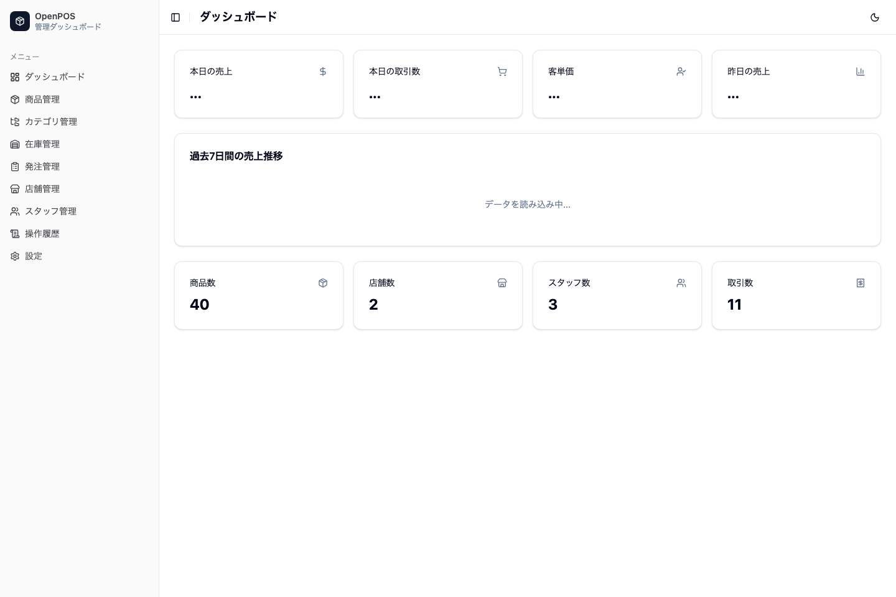
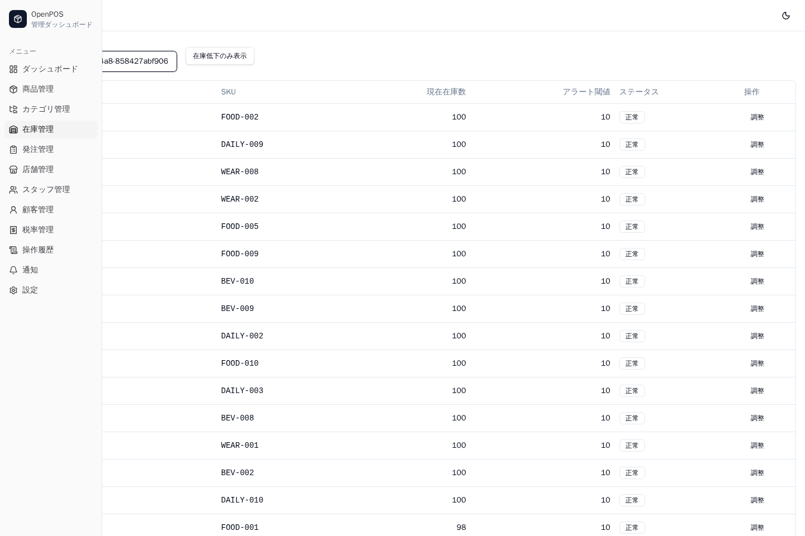
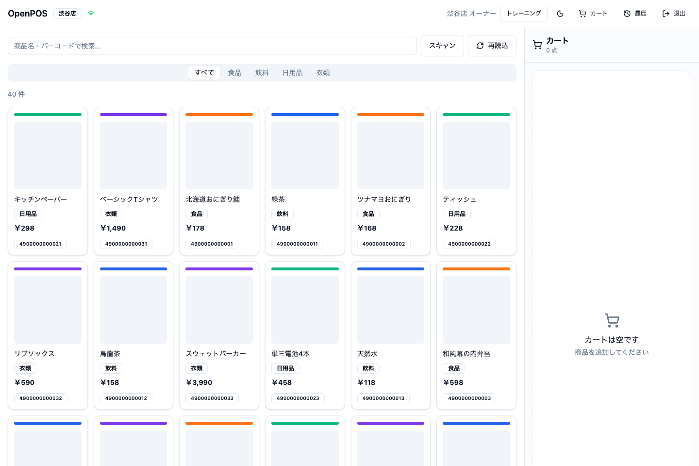

# open-pos

> Universal Point of Sale System

[](https://github.com/akaitigo/open-pos/actions/workflows/ci.yml)
[](https://github.com/akaitigo/open-pos/actions/workflows/security.yml)
[](https://github.com/akaitigo/open-pos/actions/workflows/release-drafter.yml)
[](LICENSE)
[](https://github.com/akaitigo/open-pos/actions/workflows/codeql.yml)
[](https://github.com/akaitigo/open-pos/releases/latest)
[]()
[]()

A production-ready, universal POS (Point of Sale) system featuring multi-tenant and offline-capable microservice architecture.

### Why this project?

- **Full-scale distributed architecture** — 6 microservices + gRPC + RabbitMQ event-driven design
- **Enterprise-grade multi-tenant isolation** — Automatic filtering via Hibernate Filter with zero cross-tenant data leakage
- **Offline-first PWA** — IndexedDB + Background Sync enables uninterrupted operations even during network outages
- **Relentless commitment to quality** — 1,800+ tests / JaCoCo 95%+ coverage / 5 ADRs / 60+ documents
- **Japanese retail compliance** — Invoice system (Qualified Invoice Preservation Method), privacy policy, electronic bookkeeping

## Project Status

- **Demo flow**: `make local-demo` / `make docker-demo`
- **Quality gates**: CI, dependency audit, secret scanning, CodeQL, Playwright E2E
- **Authentication**: ORY Hydra v2.2 (OIDC/PKCE) + RBAC (Owner / Manager / Cashier)

## Key Features

- **Multi-tenant**: Organization-level data isolation via Hibernate Filter
- **Offline support**: Offline operation with IndexedDB (Dexie.js), automatic sync on reconnection
- **Microservices**: 6 backend services communicating via gRPC + RabbitMQ
- **Modern frontend**: React 19 + TypeScript + Tailwind CSS + shadcn/ui

## Demo

### POS Checkout Flow


### Admin Dashboard



### Inventory Management



### POS Product Grid



How to regenerate demo assets:

```bash
pnpm e2e:install
make local-demo
pnpm dev:admin
pnpm dev:pos
pnpm demo:assets
```

See [docs/guides/demo-assets.md](docs/guides/demo-assets.md) for details.

## Architecture

```
┌──────────────────────────────────────────────────────┐
│                    Clients                            │
│  ┌─────────────┐              ┌──────────────────┐   │
│  │ POS Terminal│              │ Admin Dashboard   │   │
│  │ (React PWA) │              │ (React SPA)       │   │
│  └──────┬──────┘              └────────┬─────────┘   │
└─────────┼──────────────────────────────┼─────────────┘
          │           REST               │
     ┌────▼─────────────────────────────▼────┐
     │           api-gateway (BFF)            │
     │        Quarkus REST + Auth             │
     └──┬────┬────┬────┬────┬────┬───────────┘
        │gRPC│    │    │    │    │
   ┌────▼┐ ┌─▼──┐│┌───▼┐┌──▼─┐┌▼────────┐
   │ pos ││prod-│││inv- ││stor││analytics │
   │ svc ││uct  │││ent- ││e   ││service   │
   └──┬──┘└──┬──┘│└──┬──┘└──┬─┘└────┬────┘
      │      │   │   │      │       │
      └──────┴───┴───┴──────┴───────┘
              │           │
     ┌────────▼──┐  ┌─────▼──────┐
     │ PostgreSQL│  │  RabbitMQ  │
     │  + Redis  │  │  (Events)  │
     └───────────┘  └────────────┘
```

| Service | Technology | Role |
| --- | --- | --- |
| api-gateway | Quarkus (REST) | BFF, authentication, tenant injection |
| pos-service | Quarkus (gRPC) | Transactions, payments, receipts |
| product-service | Quarkus (gRPC) | Products, categories, tax rates |
| inventory-service | Quarkus (gRPC) | Inventory, stock-in/stock-out management |
| analytics-service | Quarkus (gRPC) | Sales analytics |
| store-service | Quarkus (gRPC) | Stores, staff management |
| pos-terminal | React PWA | POS terminal (tablet-optimized) |
| admin-dashboard | React SPA | Admin panel (desktop) |

## Tech Stack

| Category | Technology |
| --- | --- |
| Backend | Kotlin 2.3 / Quarkus 3.34 / GraalVM CE 21 / Gradle 9.4 |
| Frontend | React 19 / TypeScript / Vite 7 / Tailwind CSS + shadcn/ui |
| Database | PostgreSQL 17 (schema isolation, Flyway migrations) |
| Cache | Redis 7 (Lettuce, cache-aside pattern) |
| Messaging | RabbitMQ 4 (SmallRye Reactive Messaging) |
| Authentication | ORY Hydra v2.2 (OIDC/PKCE) |
| API | gRPC (proto3 + buf toolchain) |

## Getting Started

### Prerequisites

| Tool | Version | Purpose |
| --- | --- | --- |
| Java (GraalVM CE) | 21 | Backend build and runtime |
| Node.js | 22+ | Frontend build and runtime |
| pnpm | 10+ | Frontend package management |
| Docker & Docker Compose | v2+ | Infrastructure (PostgreSQL, Redis, RabbitMQ, Hydra) |
| buf CLI | 1.x | Protocol Buffers linting and code generation |
| curl | Any | Seed/smoke scripts |
| jq | Any | Seed/smoke scripts |
| grpcurl | Any (optional) | Used by `make grpc-test` |
| mise | Latest (recommended) | Tool version management |

> [!TIP]
> With [mise](https://mise.jdx.dev/), you can install Java, Node.js, pnpm, and buf all at once according to the definitions in `.mise.toml`.

### Quick Start

```bash
# 1. Clone the repository
git clone https://github.com/akaitigo/open-pos.git
cd open-pos

# 2. Install tools (when using mise)
mise install

# 3. Verify prerequisites
make doctor

# 4. Install frontend dependencies
pnpm install

# 5a. Local demo (recommended: infrastructure in Docker, backend on host)
make local-demo
pnpm dev:admin   # http://localhost:5174
pnpm dev:pos     # http://localhost:5173

# 5b. Container demo (backend also runs in Docker)
make docker-demo
pnpm dev:admin
pnpm dev:pos
```

`make local-demo` / `make docker-demo` generates `apps/*/public/demo-config.json`, so simply reloading the browser picks up the latest seed data (organization, stores, terminal IDs).

The seeded demo data is idempotent. It creates a fixed organization, 2 stores, 2 terminals per store, owner/manager/cashier staff, 40 products, inventory, and 10 sample transactions.

### Development Commands

```bash
# Start infrastructure + development tools
make up-dev
make logs         # Docker Compose logs
make logs-pos     # pos-service logs (running mode)

# Start backend in quarkusDev mode (for individual service development)
make dev-product   # product-service
make dev-gateway   # api-gateway

# Frontend development servers
pnpm dev:pos       # POS terminal -> http://localhost:5173
pnpm dev:admin     # Admin panel  -> http://localhost:5174

# Testing
make test          # Backend tests
make test-apps     # Frontend unit/functional tests
make grpc-test     # gRPC health check (against running services)
make verify        # typecheck + lint + backend/frontend tests
pnpm e2e:install   # Initial Playwright browser installation
make verify-full   # verify + docker-demo + Playwright E2E

# Linting
make lint          # Proto + Frontend

# Database utilities
make db-backup
make db-restore FILE=.local/backups/openpos-20260314-120000.sql
make reset         # Recreate PostgreSQL volume + reseed
```

`pnpm test` runs unit/functional tests for `packages/` and `apps/`. E2E tests are opt-in via `pnpm test:e2e` (does not depend on Playwright browsers).

### Local Development Mode Details

Two local development modes are available. See [docs/guides/local-development.md](docs/guides/local-development.md) for details.

| Mode | Command | Purpose |
| --- | --- | --- |
| `local-demo` | `make local-demo` | Day-to-day development (host execution) |
| `docker-demo` | `make docker-demo` | Release verification, CI reproduction |

Stop the current backend before switching to a new mode:

```bash
# Switch from local-demo to docker-demo
make local-down
make docker-demo

# Switch from docker-demo to local-demo
make docker-down-core
make local-demo
```

For detailed setup instructions, see [docs/guides/setup.md](docs/guides/setup.md).

## Project Structure

```
open-pos/
├── proto/              # Protobuf definitions (buf workspace)
├── services/           # Quarkus microservices
│   ├── api-gateway/
│   ├── pos-service/
│   ├── product-service/
│   ├── inventory-service/
│   ├── analytics-service/
│   └── store-service/
├── apps/               # React frontends
│   ├── pos-terminal/
│   └── admin-dashboard/
├── packages/           # Shared TypeScript packages
│   └── shared-types/
├── e2e/                # Playwright E2E tests
├── infra/              # Docker Compose + init scripts
└── docs/               # Architecture, design, and guides
```

## Documentation

| Category | Link |
| --- | --- |
| Documentation Index | [docs/README.md](docs/README.md) |
| Setup | [docs/guides/setup.md](docs/guides/setup.md) |
| Local Development Modes | [docs/guides/local-development.md](docs/guides/local-development.md) |
| Local Development Runbook | [docs/runbook/local-dev.md](docs/runbook/local-dev.md) |
| Architecture Overview | [docs/architecture/system-overview.md](docs/architecture/system-overview.md) |
| API Design | [docs/architecture/api-design.md](docs/architecture/api-design.md) |
| Data Model | [docs/architecture/data-model.md](docs/architecture/data-model.md) |
| Requirements Overview | [docs/requirements/overview.md](docs/requirements/overview.md) |
| Roadmap | [docs/plans/roadmap.md](docs/plans/roadmap.md) |
| ADR | [docs/adr/001-monorepo.md](docs/adr/001-monorepo.md) |

## Troubleshooting

### `make doctor` fails

`make doctor` verifies that prerequisite tools are installed at the correct versions. If it fails, check the output and install any missing tools.

```bash
# Using mise (recommended)
mise install

# Manual installation
# Java: https://github.com/graalvm/graalvm-ce-builds/releases
# Node.js: https://nodejs.org/
# buf: https://buf.build/docs/installation
```

### Cannot connect to Docker daemon

Make sure Docker Desktop (or Docker Engine) is running.

```bash
docker info
```

On WSL2, verify that "Use the WSL 2 based engine" is enabled in Docker Desktop settings.

### Port conflicts

open-pos uses non-standard ports, but they may conflict with other projects:

| Service | Port |
| --- | --- |
| PostgreSQL | 15432 |
| Redis | 16379 |
| RabbitMQ AMQP / UI | 15672 / 15673 |
| Hydra Public / Admin | 14444 / 14445 |
| api-gateway | 8080 |
| POS Terminal dev | 5173 |
| Admin Dashboard dev | 5174 |

Stop any conflicting processes before running `make local-demo` or `make docker-demo`.

### Backend fails to start

```bash
# Check logs (host execution mode)
ls .local/logs/
cat .local/logs/pos-service.log

# Rebuild and restart
make local-down
make local-up
```

### Seed data not reflected

```bash
# Reseed
make local-seed
make local-smoke

# Reload the browser (no need to restart the dev server)
```

### Smoke test fails after mode switch

Ensure only one backend mode is running at a time:

```bash
make local-down
make docker-down-core
# Then start the desired mode
```

### Full reset

When nothing else works:

```bash
make down
docker volume rm $(docker volume ls -q | grep open-pos) 2>/dev/null || true
make local-demo
```

## License

MIT License -- See [LICENSE](LICENSE) for details.

---

> [!NOTE]
> This project was efficiently built with AI-assisted development.
> As a personal project, external contributions are not accepted and ongoing maintenance is not guaranteed.
