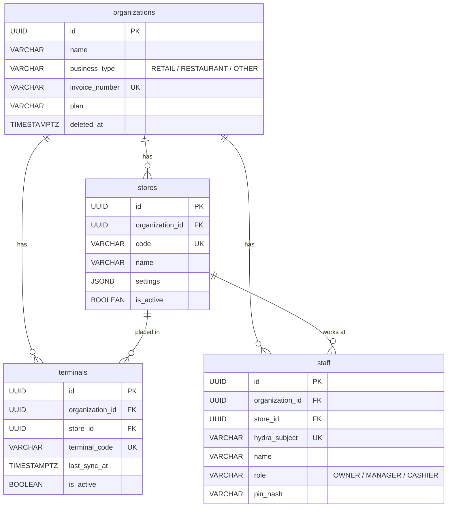
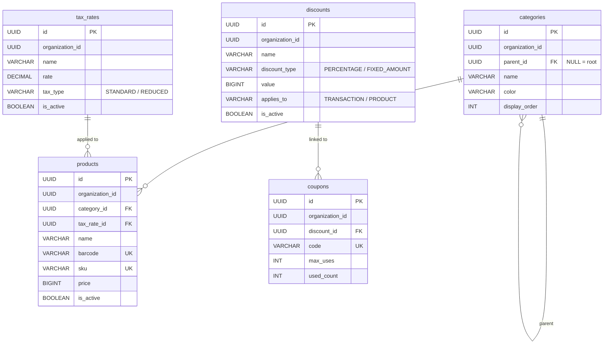
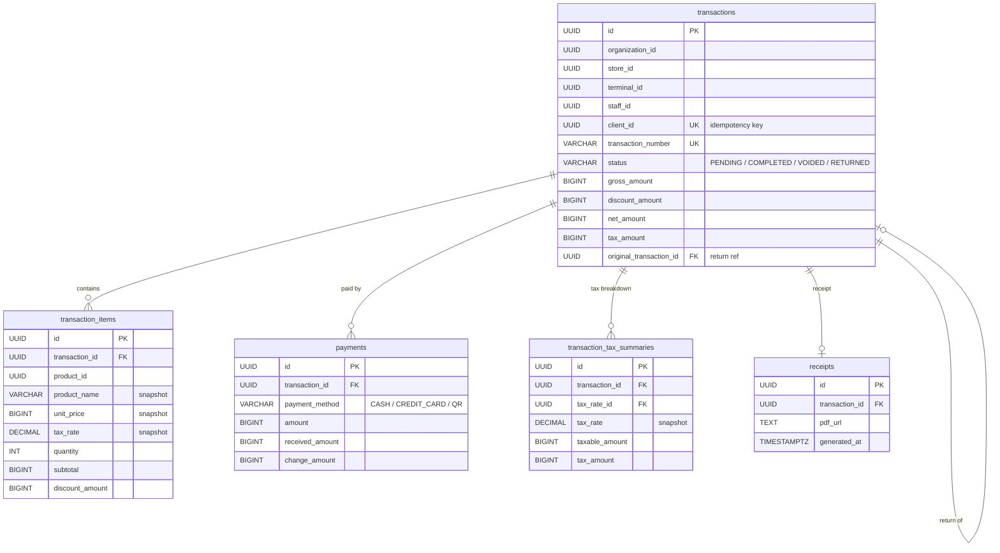
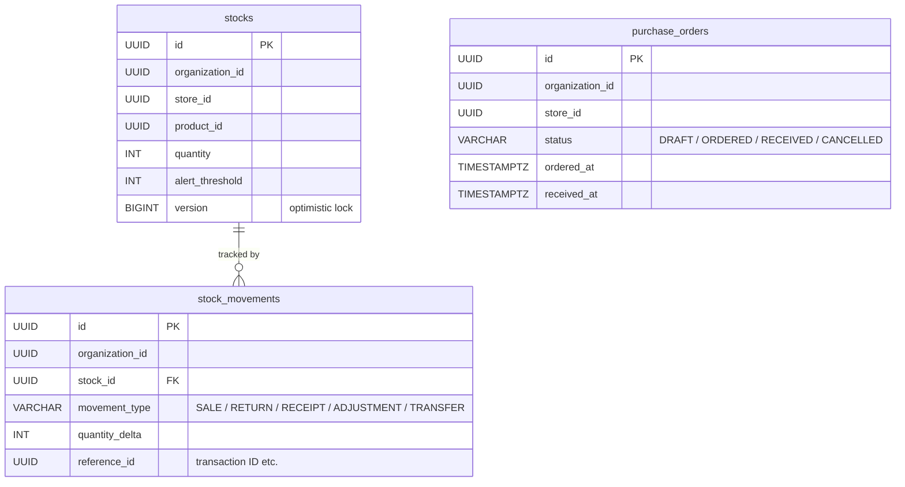
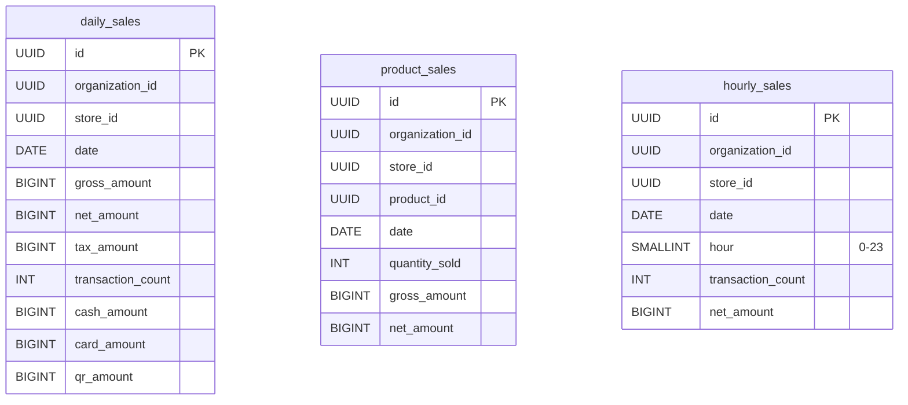

# データモデル

> 金額フィールドは全て **BIGINT（銭単位）**。100円 = `10000`。
> 全テーブルに `organization_id UUID NOT NULL`, `created_at TIMESTAMPTZ`, `updated_at TIMESTAMPTZ` を持つ。

## store_schema

### organizations
| カラム | 型 | 制約 |
|--------|-----|------|
| id | UUID | PK |
| name | VARCHAR(255) | NOT NULL |
| business_type | VARCHAR(20) | `RETAIL`/`RESTAURANT`/`OTHER` |
| invoice_number | VARCHAR(20) | UNIQUE |
| plan | VARCHAR(20) | NOT NULL |
| deleted_at | TIMESTAMPTZ | NULL |

### stores
| カラム | 型 | 制約 |
|--------|-----|------|
| id | UUID | PK |
| organization_id | UUID | FK → organizations |
| code | VARCHAR(20) | UNIQUE |
| name | VARCHAR(255) | NOT NULL |
| address | TEXT | |
| phone | VARCHAR(20) | |
| timezone | VARCHAR(50) | DEFAULT 'Asia/Tokyo' |
| settings | JSONB | |
| is_active | BOOLEAN | DEFAULT true |

### terminals
| カラム | 型 | 制約 |
|--------|-----|------|
| id | UUID | PK |
| organization_id | UUID | FK → organizations |
| store_id | UUID | FK → stores |
| terminal_code | VARCHAR(20) | UNIQUE |
| name | VARCHAR(100) | |
| last_sync_at | TIMESTAMPTZ | |
| is_active | BOOLEAN | DEFAULT true |

### staff
| カラム | 型 | 制約 |
|--------|-----|------|
| id | UUID | PK |
| organization_id | UUID | FK → organizations |
| store_id | UUID | FK → stores |
| hydra_subject | VARCHAR(255) | UNIQUE |
| name | VARCHAR(100) | NOT NULL |
| role | VARCHAR(20) | `OWNER`/`MANAGER`/`CASHIER` |
| pin_hash | VARCHAR(255) | |
| pin_failed_count | INT | DEFAULT 0 |
| pin_locked_until | TIMESTAMPTZ | |

## product_schema

### categories
| カラム | 型 | 制約 |
|--------|-----|------|
| id | UUID | PK |
| organization_id | UUID | NOT NULL |
| parent_id | UUID | FK → categories, NULL でルート |
| name | VARCHAR(100) | NOT NULL |
| color | VARCHAR(7) | |
| icon | VARCHAR(50) | |
| display_order | INT | DEFAULT 0 |

### tax_rates
| カラム | 型 | 制約 |
|--------|-----|------|
| id | UUID | PK |
| organization_id | UUID | NOT NULL |
| name | VARCHAR(50) | NOT NULL |
| rate | DECIMAL(5,4) | NOT NULL |
| tax_type | VARCHAR(20) | `STANDARD`/`REDUCED` |
| is_active | BOOLEAN | DEFAULT true |

### products
| カラム | 型 | 制約 |
|--------|-----|------|
| id | UUID | PK |
| organization_id | UUID | NOT NULL |
| category_id | UUID | FK → categories |
| tax_rate_id | UUID | FK → tax_rates |
| name | VARCHAR(255) | NOT NULL |
| barcode | VARCHAR(100) | UNIQUE per org |
| sku | VARCHAR(100) | UNIQUE per org |
| price | BIGINT | NOT NULL |
| image_url | TEXT | |
| display_order | INT | DEFAULT 0 |
| is_active | BOOLEAN | DEFAULT true |

### discounts
| カラム | 型 | 制約 |
|--------|-----|------|
| id | UUID | PK |
| organization_id | UUID | NOT NULL |
| name | VARCHAR(100) | NOT NULL |
| discount_type | VARCHAR(20) | `PERCENTAGE`/`FIXED_AMOUNT` |
| value | BIGINT | NOT NULL |
| applies_to | VARCHAR(20) | `TRANSACTION`/`PRODUCT` |
| valid_from | TIMESTAMPTZ | |
| valid_until | TIMESTAMPTZ | |
| is_active | BOOLEAN | DEFAULT true |

### coupons
| カラム | 型 | 制約 |
|--------|-----|------|
| id | UUID | PK |
| organization_id | UUID | NOT NULL |
| discount_id | UUID | FK → discounts |
| code | VARCHAR(50) | UNIQUE |
| max_uses | INT | NULL で無制限 |
| used_count | INT | DEFAULT 0 |
| valid_from | TIMESTAMPTZ | |
| valid_until | TIMESTAMPTZ | |

## pos_schema

### transactions
| カラム | 型 | 制約 |
|--------|-----|------|
| id | UUID | PK |
| organization_id | UUID | NOT NULL |
| store_id | UUID | NOT NULL |
| terminal_id | UUID | NOT NULL |
| staff_id | UUID | NOT NULL |
| client_id | UUID | UNIQUE（冪等性） |
| transaction_number | VARCHAR(50) | UNIQUE |
| status | VARCHAR(20) | `PENDING`/`COMPLETED`/`VOIDED`/`RETURNED` |
| gross_amount | BIGINT | NOT NULL |
| discount_amount | BIGINT | DEFAULT 0 |
| net_amount | BIGINT | NOT NULL |
| tax_amount | BIGINT | NOT NULL |
| voided_at | TIMESTAMPTZ | |
| original_transaction_id | UUID | FK → transactions（返品元） |

### transaction_items
| カラム | 型 | 制約 |
|--------|-----|------|
| id | UUID | PK |
| organization_id | UUID | NOT NULL |
| transaction_id | UUID | FK → transactions |
| product_id | UUID | NOT NULL |
| product_name | VARCHAR(255) | スナップショット |
| unit_price | BIGINT | スナップショット |
| tax_rate | DECIMAL(5,4) | スナップショット |
| quantity | INT | NOT NULL |
| subtotal | BIGINT | NOT NULL |
| discount_amount | BIGINT | DEFAULT 0 |

### payments
| カラム | 型 | 制約 |
|--------|-----|------|
| id | UUID | PK |
| organization_id | UUID | NOT NULL |
| transaction_id | UUID | FK → transactions |
| payment_method | VARCHAR(20) | `CASH`/`CREDIT_CARD`/`QR` |
| amount | BIGINT | NOT NULL |
| received_amount | BIGINT | 現金のみ |
| change_amount | BIGINT | 現金のみ |
| external_ref | VARCHAR(255) | カード承認番号等 |

### transaction_tax_summaries
| カラム | 型 | 制約 |
|--------|-----|------|
| id | UUID | PK |
| organization_id | UUID | NOT NULL |
| transaction_id | UUID | FK → transactions |
| tax_rate_id | UUID | FK → tax_rates |
| tax_rate | DECIMAL(5,4) | スナップショット |
| taxable_amount | BIGINT | 課税対象金額 |
| tax_amount | BIGINT | 税額 |

### receipts
| カラム | 型 | 制約 |
|--------|-----|------|
| id | UUID | PK |
| organization_id | UUID | NOT NULL |
| transaction_id | UUID | FK → transactions, UNIQUE |
| pdf_url | TEXT | Cloud Storage URL |
| generated_at | TIMESTAMPTZ | NOT NULL |

## inventory_schema

### stocks
| カラム | 型 | 制約 |
|--------|-----|------|
| id | UUID | PK |
| organization_id | UUID | NOT NULL |
| store_id | UUID | NOT NULL |
| product_id | UUID | NOT NULL |
| quantity | INT | NOT NULL |
| alert_threshold | INT | DEFAULT 10 |
| version | BIGINT | 楽観的ロック |
| UNIQUE | (store_id, product_id) | |

### stock_movements
| カラム | 型 | 制約 |
|--------|-----|------|
| id | UUID | PK |
| organization_id | UUID | NOT NULL |
| stock_id | UUID | FK → stocks |
| movement_type | VARCHAR(20) | `SALE`/`RETURN`/`RECEIPT`/`ADJUSTMENT`/`TRANSFER` |
| quantity_delta | INT | NOT NULL（負数で減少） |
| reference_id | UUID | 取引ID等 |
| note | TEXT | |

### purchase_orders
| カラム | 型 | 制約 |
|--------|-----|------|
| id | UUID | PK |
| organization_id | UUID | NOT NULL |
| store_id | UUID | NOT NULL |
| status | VARCHAR(20) | `DRAFT`/`ORDERED`/`RECEIVED`/`CANCELLED` |
| ordered_at | TIMESTAMPTZ | |
| received_at | TIMESTAMPTZ | |
| note | TEXT | |

## analytics_schema

### daily_sales
| カラム | 型 | 制約 |
|--------|-----|------|
| id | UUID | PK |
| organization_id | UUID | NOT NULL |
| store_id | UUID | NOT NULL |
| date | DATE | NOT NULL |
| gross_amount | BIGINT | DEFAULT 0 |
| discount_amount | BIGINT | DEFAULT 0 |
| net_amount | BIGINT | DEFAULT 0 |
| tax_amount | BIGINT | DEFAULT 0 |
| transaction_count | INT | DEFAULT 0 |
| cash_amount | BIGINT | DEFAULT 0 |
| card_amount | BIGINT | DEFAULT 0 |
| qr_amount | BIGINT | DEFAULT 0 |
| UNIQUE | (store_id, date) | |

### product_sales
| カラム | 型 | 制約 |
|--------|-----|------|
| id | UUID | PK |
| organization_id | UUID | NOT NULL |
| store_id | UUID | NOT NULL |
| product_id | UUID | NOT NULL |
| date | DATE | NOT NULL |
| quantity_sold | INT | DEFAULT 0 |
| gross_amount | BIGINT | DEFAULT 0 |
| discount_amount | BIGINT | DEFAULT 0 |
| net_amount | BIGINT | DEFAULT 0 |
| UNIQUE | (store_id, product_id, date) | |

### hourly_sales
| カラム | 型 | 制約 |
|--------|-----|------|
| id | UUID | PK |
| organization_id | UUID | NOT NULL |
| store_id | UUID | NOT NULL |
| date | DATE | NOT NULL |
| hour | SMALLINT | 0-23 |
| transaction_count | INT | DEFAULT 0 |
| net_amount | BIGINT | DEFAULT 0 |
| UNIQUE | (store_id, date, hour) | |
