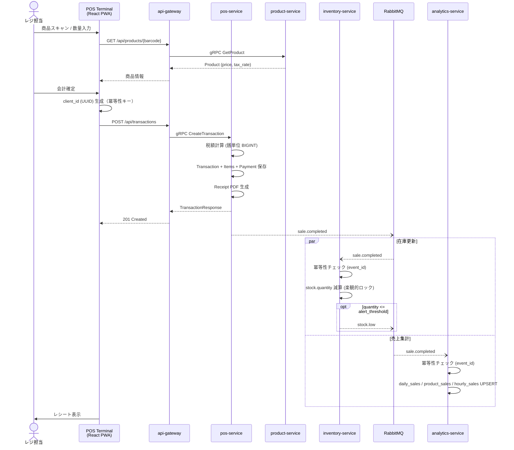
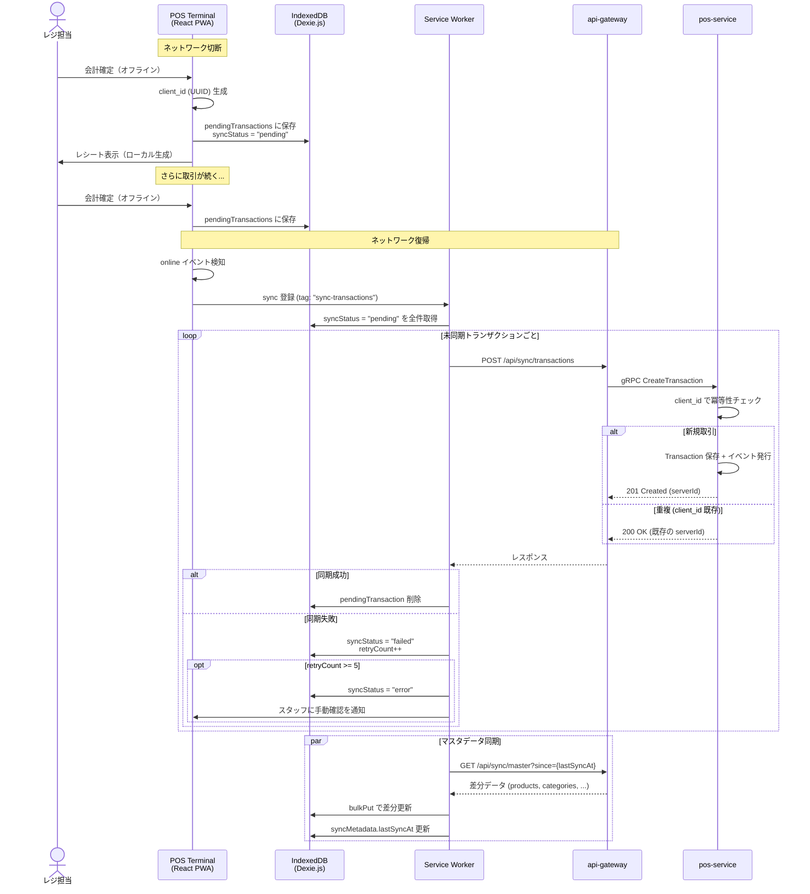
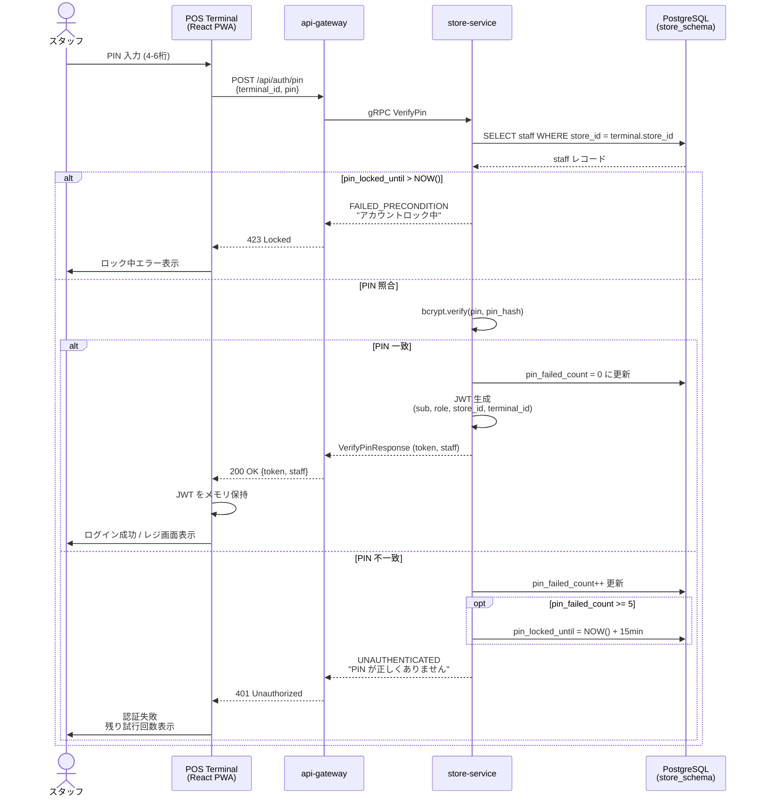

# シーケンス図

主要フローの Mermaid シーケンス図。

## POS 会計フロー

POS端末からの取引確定の一連の流れ。pos-service が取引を記録し、RabbitMQ 経由で inventory-service（在庫減算）と analytics-service（集計更新）に非同期通知する。

## オフライン同期フロー

ネットワーク切断中は IndexedDB に取引を保存し、復帰時に Service Worker の Background Sync で自動送信する。`client_id` による冪等性でリトライが安全に行われる。

## PIN 認証フロー

POS端末のスタッフ認証。ORY Hydra の OAuth2/OIDC とは別に、端末上での簡易切り替えとして PIN コードを使用する。PIN ハッシュは store-service 側で検証し、成功時に JWT を発行する。

