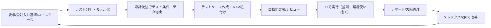

# 機能テスト（Functional Testing）リサーチ

# 機能テストのディープリサーチ（Functional Testing）

## エグゼクティブサマリー

機能テスト（functional testing）は、コンポーネント／システムが**機能要件を満たすか**を評価するテストタイプとして位置づけられる。citeturn35view0turn13view1 ただし「単体・結合・システム・受け入れ」は**テストレベル**であり、機能テストは原則として**あらゆるテストレベルで実行可能**という点が最初の混同ポイントになる。citeturn13view1

効果的な機能テストの中核は、（1）**テストベース（要求・ユーザーストーリー・ユースケース等）からの体系的設計**、（2）**トレーサビリティ（要求↔テストの紐付け）とカバレッジ可視化**、（3）**フィードバックを速くする実行基盤（CI、並列化、環境の使い捨て化）**である。citeturn25view0turn25view1turn3search3turn22search3turn21search0

自動化ツール選定は、UI E2E中心なら「安定性・並列・クロスブラウザ」を軸に比較し、バックエンド（API/サービス）機能テストは「ユニット/統合をCIで高速に回す」設計に寄せるのが実務的である。たとえばentity["company","Microsoft","software company"]のPlaywrightは自動待機（actionability checks）や並列実行を前提に設計されており、フレームワーク起因のフレーク低減に効くことが多い。citeturn26search0turn21search0turn26search22

「ROI（投資対効果）」は、削減できた回帰テスト工数と、CIリードタイム短縮・不具合流出減（手戻り減）を、導入・保守コストと比較して評価する。実例としてentity["company","Sansan","jp business software"]は回帰E2Eの自動化により、2人で半日〜1日かかっていたテストを15分へ短縮したと報告している。citeturn17view3

---

## 定義と目的

機能テストは、**「機能要件を満たすか」を評価するテスト**であり、entity["organization","ISTQB","software testing board"]の標準用語集では「コンポーネントまたはシステムが機能要件を満たすかを評価するために実施するテスト」と定義される。citeturn35view0  
一方で、（実務でよく言う）「仕様に基づくブラックボックステスト」は、仕様の分析に基づき内部構造に依らずに設計する技法群のことを指し、機能テストの設計で頻出する（同値分割・境界値など）点で密接である。citeturn34view1turn14view0

機能テストを含む「テスト」の目的は広く、entity["organization","JSTQB","japan software testing board"]のFoundation Levelシラバスでは、成果物（要件/設計/コード等）の評価、欠陥検出、カバレッジ確保、リスク低減、要件充足の検証、根拠ある判断材料の提供、品質への信頼構築、妥当性確認などが挙げられている。citeturn13view2  
機能テストはこのうち特に「**仕様化された要件が満たされているかどうかの検証**」「**ステークホルダー期待に沿って動作するかの妥当性確認**」を直接支える。citeturn13view2

---

## テストレベルと機能テストの関係

「単体・結合・システム・受け入れ」は**テストレベル**（組織的にまとめて管理するテスト活動のグループ）であり、「機能テスト」は**テストタイプ**（品質特性に関連するテスト活動のグループ）で、テストタイプは原則として**全テストレベルで実行可能**と整理される。citeturn13view1

### テストレベル別に見た機能テストの“狙い”の違い

| テストレベル | 主な対象/観点 | 機能テストとしての焦点（例） | テストベースの例 |
|---|---|---|---|
| コンポーネント（ユニット） | 単一コンポーネント | 関数/クラスが仕様通りの入出力・例外・状態変化を満たす | 詳細設計、API契約、仕様、ユーザーストーリー受け入れ基準（分解後）citeturn13view1turn28search6 |
| コンポーネント統合（結合） | コンポーネント間I/F | I/Fのパラメータ取り扱い、組み合わせ、エラー伝播 | I/F仕様、シーケンス、契約 |
| システム | E2E/ユーザー行動 | 業務フロー（注文→決済→通知等）が要件通り完結する | 要求仕様、ユースケース/シナリオ、受け入れ基準citeturn13view1turn28search1turn28search6 |
| システム統合 | 外部サービス連携 | 外部I/F、異常系、タイムアウト、リトライ | 外部API仕様、SLA、契約 |
| 受け入れ | 受け入れ判断 | ビジネスプロセス/受け入れ基準を満たすか | 受け入れ基準、契約・規制要件citeturn13view1turn35view0 |

上の表は、同じ「機能テスト」でも、**テストレベルが上がるほど（1）仕様が抽象化し、（2）環境要因の影響が増え、（3）失敗時の原因切り分けコストが増す**という実務上の差を示す。これを前提に、上位レベルほど“本数を絞って価値の高いシナリオに集中”し、下位レベルほど“網羅や組み合わせに寄せる”設計が一般に有利になる。citeturn25view0turn25view1turn13view1

image_group{"layout":"carousel","aspect_ratio":"16:9","query":["software testing pyramid diagram","agile testing quadrants diagram","V-model software testing diagram"],"num_per_query":1}

---

## テスト設計技法とテストケース設計

機能テスト（特に仕様ベース）で頻出する設計技法は、入力/状態/条件分岐を**モデル化して代表点を選ぶ**ことで、限られたケース数で欠陥検出力を上げる。citeturn28search17turn14view0 ここでは、指定された5技法を「何をカバレッジアイテムにするか」という観点で整理する。

### 主要設計技法の要点（適用判断・成果物・カバレッジ）

| 技法 | 何に効くか | 典型的な成果物 | カバレッジアイテム/測り方（例） |
|---|---|---|---|
| 同値分割（EP） | 入力/出力ドメインを“同等に扱われる領域”へ分割し代表値で検証 | 同値パーティション一覧、代表値表 | 通過したパーティション数 ÷ 識別した全パーティション数（%）citeturn4search1turn14view1 |
| 境界値分析（BVA） | バグが潜みやすい境界（最小/最大、隣接値）を狙い撃ち | 境界値リスト、境界×データ表 | 通過した境界（＋隣接）数 ÷ 識別した境界（＋隣接）総数（%）citeturn4search2turn14view1 |
| デシジョンテーブル | 条件の組合せ×結果（アクション）を体系化。ビジネスルール検証に強い | デシジョンテーブル、判定規則（ルール） | 実行したルール列数 ÷ 実行可能ルール列総数（%）citeturn4search3turn14view2 |
| 状態遷移 | 状態と遷移（イベント/ガード/アクション）を持つ仕様（例：申請→承認→却下、ログイン状態）に強い | 状態遷移図/表、遷移シナリオ | 全状態/全有効遷移/全遷移（有効＋無効）等、基準ごとに測定citeturn3search13turn14view3 |
| ユースケーステスト | 利用者視点のシナリオ（主/代替/例外フロー）に沿ってE2E価値を担保 | ユースケースシナリオ、テスト条件 | シナリオ（フロー）/受け入れ基準のカバレッジ（RTMで測定）citeturn28search1turn3search3 |

設計技法は“全部やる”のではなく、仕様の性質に合わせて組み合わせるのが現実解である。たとえば「入力バリデーション」はEP+BVA、「料金計算や割引」はデシジョンテーブル、「ワークフロー」は状態遷移、「業務価値の担保」はユースケース/ユーザーストーリー受け入れ基準ベース、という使い分けが合理的になる。citeturn14view1turn14view2turn14view3turn28search6

### テストケース設計のベストプラクティス

テストケースの品質は「短期の検出力」だけでなく「変更への追従性」で決まるため、設計時点で保守コストを下げる工夫が重要になる。JSTQBではブラックボックス/ホワイトボックス/経験ベースを補完関係として整理しており、仕様ベースで取り切れない欠陥を経験ベースで拾う設計が推奨される（＝機能テストも“仕様だけ”で閉じない）。citeturn14view0

実務で効くポイントは次の通り（テンプレとセットで運用すると効果が出やすい）。

- **1テスト=1主張（One Assertion of Intent）**：検証意図を単一に保つ（失敗原因を局所化）。  
- **前提条件を“手順”ではなく“状態”で書く**：ログイン済、商品Aが存在、など。再利用性が上がる。  
- **期待結果は観測可能な形に落とす**：画面表示/レスポンス/DBレコード等。  
- **テストデータは宣言的に**（例：テストデータID、生成ルール、固定値の理由）。  
- **トレーサビリティを必須化**（要求/受け入れ基準IDを持たせる）。トレーサビリティマトリクスでカバレッジが測れる。citeturn3search3

---

## テストケース設計テンプレートとドキュメント運用

機能テストをチームで運用する場合、テスト成果物（テスト計画・テストケース・レポート・欠陥票など）の粒度を揃えることがスケールの前提になる。entity["organization","ISO","standards body"]のISO/IEC/IEEE 29119-3は、テスト文書テンプレートを定義し、テストプロセスのアウトプットとしての文書を説明する。citeturn37search2turn37search1  
またJSTQBシラバスでも、テスト計画書の目的・典型内容（スコープ、テストベース、リスク、アプローチ、収集すべきメトリクス、テストデータ要件、環境要件など）を示し、詳細は29119-3で確認できるとしている。citeturn25view0

### 最小で回るテストケーステンプレ（例）

| 項目 | 記入ガイド（機能テスト向け） |
|---|---|
| Test ID | 変更に強い識別子（例：FT-ORD-001） |
| 要求/ストーリー/UC | 要求ID・受け入れ基準ID・ユースケース名（トレーサビリティ用）citeturn3search3turn28search6 |
| 目的 | 何を保証するか（“何を”） |
| 前提条件 | 状態（例：在庫あり、権限=管理者） |
| 手順 | UI/API/DBなど操作を最小限に列挙 |
| テストデータ | データID、生成方法、範囲（EP/BVAの根拠含む）citeturn14view1turn4search2 |
| 期待結果 | 観測点（画面、ログ、レスポンス、状態遷移） |
| 優先度/リスク | 失敗時影響（RBTにも連動）citeturn25view0turn13view3 |
| 自動化方針 | 自動化対象/対象外の理由、実行頻度（PR/夜間/リリース前） |
| タグ | smoke / regression / critical path 等citeturn10search14turn35view0 |

欠陥管理もテンプレ化が有効で、JSTQBは欠陥レポートに含める情報として、識別子、概要、発生日・起票者、環境、コンテキスト（関係するテストケース等）、再現手順、期待結果と実結果、重要度/優先度、状態などを挙げている。citeturn25view3

---

## 機能テスト向けカバレッジ指標と測定方法

カバレッジは「指定されたカバレッジアイテムがどの程度テストされているか」を%で表す概念であり、カバレッジアイテムは同値パーティションやコードステートメントなど、カバレッジの基礎となる実体や属性を指す。citeturn5search2turn5search10  
機能テストでは、**コード網羅率だけに寄せると“要件の穴”が残る**ため、仕様・モデル・リスクのカバレッジを主軸に置く方が整合的になりやすい。citeturn25view1turn3search3turn13view1

### 機能テストで使い勝手の良いカバレッジ/KPIセット

| 指標 | 何を示すか | どう測るか（実務） |
|---|---|---|
| 要求カバレッジ | 要求/受け入れ基準がテストで覆われている度合い | RTM（要求↔テスト）で、テストが紐づく要求数÷総要求数citeturn3search3turn25view1 |
| ユースケース/シナリオカバレッジ | 重要業務フローの担保度 | ユースケースの主/代替/例外フローごとにテストを割当て、通過フロー数÷対象フロー数citeturn28search1turn3search3 |
| ルール（判定規則）カバレッジ | ビジネスルール組合せの網羅 | デシジョンテーブルの実行列数÷実行可能列数citeturn14view2turn4search3 |
| 状態/遷移カバレッジ | 状態機械仕様の網羅 | 全状態/全有効遷移/全遷移など基準を選び測定citeturn14view3turn3search13 |
| 境界値カバレッジ | 境界の検証度 | 識別境界（＋隣接）に対する実行割合citeturn14view1turn4search2 |
| リスクカバレッジ | 高リスク領域への投資度 | リスクレジスターの高リスク項目に対するテスト実施率/実行頻度citeturn25view0turn25view1 |

JSTQBは、モニタリングのための代表メトリクスとして、進捗、品質、欠陥、リスク、カバレッジ（要件カバレッジ、コードカバレッジ）、コストなどを挙げている。citeturn25view1 重要なのは「指標を増やすこと」ではなく、**意思決定に効く最小セット**に固定し、テスト計画（どの頻度でどの粒度で見るか）とセットで運用することだ。citeturn25view0turn25view1

---

## 自動化と主要ツール/フレームワーク比較

機能テスト自動化の狙いは「手作業の置換」だけではなく、**短いフィードバックループで回帰リスクを減らすこと**にある。JSTQBはDevOps/CI/CDの文脈で自動化による迅速なフィードバック、安定したテスト環境構築、手動テスト繰り返し削減などの利点を明記している。citeturn13view0

### ツール比較（UI中心＋バックエンド基盤）

下表の根拠は各ツールの公式ドキュメント（言語/ブラウザ/並列/CI）に基づく。citeturn20search2turn21search0turn21search1turn1search0turn1search1turn21search2turn1search3turn2search0turn27search0turn2search2turn2search3

| ツール | 主用途（機能テストでの典型） | 言語/記法 | 強み | 弱み/注意点 | CI/CD・並列 |
|---|---|---|---|---|---|
| Selenium | Web UI回帰（広い資産/エコシステム） | 主要バインディング（.NET, Java, JS, Python, Ruby 等）citeturn20search2 | WebDriver標準・資産が多い、Gridで分散並列citeturn20search12turn20search8 | テスト枠は別途必要、待機/同期設計を誤ると不安定化しやすい | Gridで並列（複数マシン/ノード）citeturn20search12turn20search8 |
| Playwright | Web UI E2E/クロスブラウザ | TS/JS, Python, .NET, Javaciteturn1search0 | 自動待機（actionability checks）でレースを減らすciteturn26search0turn26search22、並列実行が標準citeturn21search0 | 上位E2Eの過剰増殖は保守コスト化（設計統制が必要） | CI手順が整備citeturn21search1turn21search4 |
| Cypress | フロントエンド寄りE2E/コンポーネント | JS中心 | ブラウザ内実行＋開発者体験に強いciteturn26search2turn26search16 | ブラウザ制約があり、少なくともChrome系＋Firefox中心（WebKitは実験扱いがある）citeturn1search1turn1search17 | GitHub Actions統合＆並列化手順citeturn21search2 |
| Robot Framework | 受け入れ/ATDDのキーワード駆動 | 独自テキスト記法（Python拡張） | キーワード駆動で可読性、ATDD/BDDに適用citeturn1search3turn26search3 | キーワード設計が弱いと“巨大手順書”化しがち（設計規約が必須） | Pabotで並列citeturn21search3 |
| Robot Framework Browser | Robot FrameworkでモダンWeb自動化 | RF + Playwright | Playwright基盤で速度/信頼性を狙うciteturn27search2turn27search6 | Node要件など運用要件が増える場合 | CI導入手順は周辺資料ありciteturn27search16 |
| TestCafe | Web UI E2E（Nodeベース） | JS/TSciteturn31search3 | 多ブラウザ（Safari含む）を挙げやすいciteturn2search0、並列（concurrency）citeturn27search0 | 並列は順序依存テストに不向き（disableが必要）citeturn27search3 | GitHub Actions統合ガイドciteturn27search1 |
| JUnit | バックエンドのユニット/統合 | Java | デファクト、並列設定可（opt-in）citeturn2search2 | 共有資源があると並列で不安定化（テスト分離設計が必要）citeturn2search2 | ビルド/CI統合が容易（Maven/Gradle等）citeturn2search14 |
| TestNG | Java系テスト（並列/構成柔軟） | Java | アノテーション/構成が豊富citeturn2search3 | 設定が複雑化しやすい（チーム標準が必要） | 公式ドキュメントに基づき運用citeturn2search3 |

### サンプルコード（最小スニペット）

以下は「画面上の操作→期待結果」を機能テストとして表現する最小例（周辺の設計規約・データ分離が実務では重要）。Playwrightは自動待機を前提に設計される。citeturn26search22turn26search0

```ts
// Playwright (TypeScript) - ログイン→見出し確認（例）
import { test, expect } from '@playwright/test';

test('ログイン後にダッシュボードが表示される', async ({ page }) => {
  await page.goto('https://example.com/login');
  await page.getByLabel('メールアドレス').fill('user@example.com');
  await page.getByLabel('パスワード').fill('secret');
  await page.getByRole('button', { name: 'ログイン' }).click();
  await expect(page.getByRole('heading', { name: 'ダッシュボード' })).toBeVisible();
});
```

Cypressはネットワーク待機（spy/stub）を併用して“安定した同期点”を置ける。citeturn23search1turn23search9

```js
// Cypress - API呼び出しを待って表示を確認（例）
cy.intercept('GET', '/api/todos').as('getTodos');
cy.visit('/');
cy.wait('@getTodos');
cy.get('[data-testid="todo-list"]').should('exist');
```

Robot Frameworkは“キーワード”として機能を表現し、受け入れ基準の共有に寄せやすい。citeturn1search3turn32search0

```robot
*** Settings ***
Library    Browser

*** Test Cases ***
ログイン後にダッシュボードが見える
    New Page    https://example.com/login
    Fill Text   label=メールアドレス    user@example.com
    Fill Text   label=パスワード        secret
    Click       role=button[name="ログイン"]
    Get Text    role=heading[name="ダッシュボード"]
```

---

## テストデータ管理・モック/スタブ戦略・環境オーケストレーション

### テストデータ管理（TDM）の実務パターン

機能テストは「正しい入力→正しい結果」の検証であるため、テストデータが結果を支配する。特に並列化すると、**アカウント/レコードの共有**が衝突要因になるため、次のいずれか（または併用）を採るのが定石である。citeturn21search0turn27search0turn2search2turn25view1

- **生成（factory/builder）**：テスト実行時にユニークデータを生成（UUID、採番、時刻固定）。  
- **シード（seed）+リセット**：テスト前に固定データ投入、後でクリーンアップ。  
- **テナント分離**：実行ジョブごとにスキーマ/DB/namespaceを分離（環境対価は増える）。  
- **使い捨て環境**：依存をコンテナで立ち上げ、実行後に破棄（後述Testcontainers/Compose）。

### モック/スタブ/テストダブルの整理と使い分け

外部依存を置き換える代用品は総称してテストダブルと呼ばれ、スタブ/モック等の用語混乱が起きやすい。citeturn23search2  
ここでは実務に役立つ粒度で次のように使い分けるとよい（目的＝再現性、速度、原因切り分け）。

- **スタブ**：決まった応答を返す（機能テストの入力制御）。WireMockはHTTPスタブを管理できる。citeturn23search3turn23search11  
- **スパイ**：呼び出し有無/回数/引数を記録する（副作用の観測）。Cypressの`cy.intercept`はspyとしても使える。citeturn23search1  
- **モック**：期待される相互作用（呼び出し）を事前に定義して検証（契約に寄せる）。citeturn23search2  
- **フェイク**：軽量な実装（例：インメモリ）で振る舞いを提供（統合度合いは設計次第）。citeturn23search2

UI機能テストでのネットワーク制御は、PlaywrightがHTTP/HTTPSのトラフィックをモック/改変できるAPIを提供している。citeturn23search0 これにより「外部APIが不安定で落ちる」「テストデータが揺れる」などのノイズを減らし、機能テストを“仕様の検証”に寄せられる。

### 環境とオーケストレーション（コンテナ・並列・分離）

機能テストの失敗原因は「実装バグ」だけでなく「環境差分」でも起きるため、環境をコード化して再現性を上げることが重要になる。Docker Composeは、サービス/ネットワーク/ボリュームをYAMLで定義し、開発・テスト・CIでも同じ構成を起動できることを明記している。citeturn22search3

依存サービス（DB/キュー等）をテスト実行時に起動・破棄するならTestcontainersが代表的で、「本番相当のサービスをモックなしでテストに持ち込む」ことを狙える。citeturn22search5turn22search0turn22search15

並列実行は、スイート時間短縮の最も直接的なレバーであり、Playwrightはワーカープロセスでの並列を標準にする。citeturn21search0 SeleniumはGridが複数マシン上での並列実行を目的に掲げている。citeturn20search12turn20search8 TestCafeはconcurrencyで同一ブラウザインスタンスを複数起動し負荷分散できる。citeturn27search0turn27search3

---

## 落とし穴・対策・事例・推奨プロセスとROI

### よくある落とし穴と実務的な対策

UI機能テストの最大の敵は「フレーク（flaky）」＝たまに落ちる不安定さで、原因の多くは同期（待機）と依存（外部/データ/順序）にある。citeturn26search0turn23search1turn21search0turn27search3 対策はツール機能だけでは足りず、**設計規約＋環境分離_toggle**が必要になる。

- **自動待機に寄せる（手動sleepを減らす）**：Playwrightはactionability checksで操作前に条件を満たすまで自動待機する。citeturn26search0turn26search22  
- **ネットワークを“観測点/同期点”にする**：Cypressの`cy.intercept`はspyとして使え、待機点を置ける。citeturn23search1turn23search9  
- **ページ要素の抽象化（POM等）で変更耐性を上げる**：POM採用はUI変更時の修正範囲を局所化できる（後述の事例）。citeturn17view3turn18view3  
- **順序依存テストを避ける**：TestCafeは並列が順序依存テストに不向きと注意している。citeturn27search3  
- **上位E2Eの増やしすぎを防ぐ**：価値の高い“クリティカルパス”に絞り、下位で網羅する（テストレベル×タイプの整理が前提）。citeturn13view1turn25view0

### 実務事例（3件以上）

**entity["company","SmartHR","jp hr software company"]：Playwrightで新規プロダクトのE2Eを実装**  
既存はRspec×Selenium×Capybaraが主流だったが、新規プロダクトでPlaywrightを採用。理由として、自動待機（Auto-waiting）でフレーク削減、コード生成（レコーディング）で立ち上がりを早くする、環境構築容易、実行速度、TypeScriptとの親和性などを挙げている。citeturn18view0turn26search1turn26search0turn1search0 さらにglobalSetupでログイン状態を作り、POMで保守性を上げる構成を紹介している。citeturn18view3turn26search14

**entity["company","Sansan","jp business software"]：SETチームがPlaywrightで回帰E2Eを自動化し大幅短縮**  
リリース直後で変更が多く、手動回帰が「時間がかかりリリースサイクルに追いつかずフィードバックが遅い」課題。ノーコード/ローコード運用はあったが、エンジニアが書ける形を重視してPlaywrightを採用し、POMも導入。結果として、第1四半期でE2E自動化を完了し、従来「2人で半日〜1日」かかっていたテストが「15分」で終わるようになったと報告している。citeturn16view1turn17view3

**entity["company","Kyash","jp fintech company"]：Mock中心からTestcontainersで“リアルな統合テスト”へ**  
Mock中心でDBやキューの実テストがなく、AWSへデプロイしないと本番相当確認ができず、修正の数だけデプロイが必要になり、CI/CD通過回数増で負荷・開発速度低下が発生していた。citeturn18view6turn16view2 導入後はDDDの層ごとにテストを分け統合テストを自動化し、DBスキーマ変更で即テストが落ちるようにして整合性チェックを強化、SQSのようなローカル再現が難しいリソースも模擬しやすくなったと述べている。citeturn19view0turn22search5 また、外部APIはMock、内部連携はTestcontainersというハイブリッド運用で正確性と効率を両立し、デプロイの無駄時間削減・回帰精度向上に繋がったとしている。citeturn19view0

（補助事例）entity["company","エムスリー","jp healthcare company"]：ローコードからPlaywright移行を検討  
全員QA方針やCI/CD親和性、テストコードのバージョン管理、カスタマイズ性などを背景に、ローコードよりコードベース自動テスト（Playwright）へ移行する動きを説明している。citeturn19view2

### 推奨プロセス（ワークフロー）とKPI

JSTQBはテスト計画書が、目的・リソース・プロセスを表し、スケジュールや基準遵守、コミュニケーション手段にもなることを示し、典型構成（リスク、アプローチ、収集メトリクス、データ/環境要件を含む）を挙げている。citeturn25view0 これを機能テストの運用へ落とすと、次の流れが実装しやすい。



KPIは「測って行動できる」ものに限定し、JSTQBが挙げるメトリクス分類（進捗/品質/欠陥/リスク/カバレッジ/コスト）から、機能テストに効く最小セットを選ぶのがよい。citeturn25view1 例：

- **要件カバレッジ（RTM）**：リリース判断の根拠になる。citeturn3search3turn25view1  
- **回帰スイート実行時間（CIリードタイム）**：短いほど頻繁に回せる（並列化施策の効果測定）。citeturn21search0turn20search8  
- **欠陥メトリクス（欠陥密度/検出率/流出率）**：品質・テスト投資のバランス指標。citeturn10search8turn25view1  
- **フレーク率（再実行で通る割合）**：自動化の信頼性指標（改善対象の優先付け）。citeturn26search0turn21search0  

### コスト/工数とROI（実務計算の型）

シフトレフトは初期に追加のトレーニング・労力・コストがかかり得る一方、後工程での削減が期待されるとJSTQBが述べている。citeturn13view0 よってROIは「初期投資 + 継続保守」を分けて考えるとブレにくい。

- **初期投資**：基盤構築（CI、並列、環境）、フレーム設計（POM/共通ライブラリ）、主要シナリオ実装  
- **運用コスト**：仕様変更追従、テストデータ/アカウント管理、フレーク対応  
- **便益**：回帰工数の削減、リリース頻度向上、デプロイ無駄の削減（例：Kyashの課題）、障害調査の高速化（テストが根拠になる）citeturn18view6turn19view0turn17view3  

定量化の最小式（例）：
- 年間便益（時間）＝（手動回帰時間 − 自動回帰時間）× 回帰回数  
- 年間便益（費用）＝上記 × 人件費レート  
- ROI＝（年間便益 − 年間運用コスト）÷ 初期投資

Sansanの事例のように、回帰時間が「半日〜1日→15分」規模で短縮できると、CIに毎回載せる/リリース前に常時全件実施する、といった運用品質も同時に上がりやすい（＝便益が“時間”以外にも波及する）。citeturn17view3turn25view1

---

## 参考リンクとサンプルリポジトリ

以下は公式ドキュメント／公式サンプルを中心とした追加学習リソース（サンプルはCI設定例まで含むことが多い）。citeturn31search1turn31search2turn31search0turn31search4turn32search0turn22search12turn20search0turn2search3

```text
Playwright
- https://playwright.dev/docs/intro
- https://playwright.dev/docs/test-parallel
- https://github.com/microsoft/playwright-examples

Cypress
- https://docs.cypress.io/
- https://docs.cypress.io/app/continuous-integration/github-actions
- https://github.com/cypress-io/cypress-example-kitchensink

Selenium
- https://www.selenium.dev/documentation/
- https://www.selenium.dev/documentation/grid/
- https://www.selenium.dev/downloads/

Robot Framework
- https://robotframework.org/robotframework/latest/RobotFrameworkUserGuide.html
- https://docs.robotframework.org/docs/parallel
- https://github.com/robotframework/RobotDemo

Robot Framework Browser（Playwrightベース）
- https://docs.robotframework.org/docs/different_libraries/browser
- https://github.com/MarketSquare/robotframework-browser

TestCafe
- https://testcafe.io/documentation/
- https://testcafe.io/documentation/403626/guides/intermediate-guides/run-tests-concurrently
- https://github.com/DevExpress/testcafe-examples

JUnit / TestNG（バックエンド）
- https://docs.junit.org/
- https://github.com/junit-team/junit-examples
- https://testng.org/
- https://github.com/testng-team/testng

Testcontainers（依存サービスの使い捨て起動）
- https://testcontainers.com/getting-started/
- https://docs.docker.com/testcontainers/
- https://github.com/testcontainers/testcontainers-java-spring-boot-quickstart
```

## 対象スタック
- Backend: Kotlin / Quarkus / gRPC サービス単位の機能検証
- Frontend: React コンポーネント + ページ単位のユーザーフロー検証
