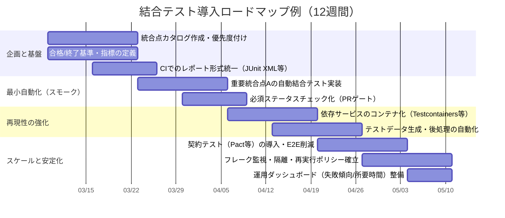

# 結合テスト（Integration Testing）リサーチ

# 結合テストの分析レポート

## エグゼクティブサマリー

結合テスト（integration testing）は、単体で動作するコンポーネントやモジュールを統合したときに、**インターフェース（契約）と相互作用（データ・制御・タイミング）が設計通りに成立するか**を検証するテストレベルである。ISTQBの定義では「統合されたコンポーネント／システム間のインターフェースや相互作用に存在する欠陥を露出させるためのテスト」であり、結合（integration）自体は「コンポーネントやシステムをより大きな集合体へ組み合わせるプロセス」と整理される。citeturn9view2turn29view0

実務上は、JSTQBシラバスが示すように、結合テストは「コンポーネント統合テスト（ユニット統合）」と「システム統合テスト」に分かれ、前者はコンポーネント間のインターフェース／相互処理、後者はテスト対象システムと外部システム／外部サービスとのインターフェースに焦点を当てる。また、統合戦略（トップダウン／ボトムアップ／ビッグバン等）への依存が大きく、適切なテスト環境が重要になる。citeturn8view1

本レポートの結論を先に述べると、現代的な結合テストの成功条件は「（1）統合点の明確化（契約・依存関係・データ境界）」「（2）テスト設計の粒度とダブル（モック／スタブ等）の使い分け」「（3）CI/CDでの安定実行（再現性・レポーティング・フレーク対策）」「（4）カバレッジと合格基準の定量化」の4点に集約される。citeturn10view0turn20view3turn21view2turn13view0

統合戦略については、ビッグバンは局所化困難・開始遅延のリスクが高いため、原則はインクリメンタル（トップダウン／ボトムアップ）を基本とし、組織やリリース形態に応じてサンドイッチ（ハイブリッド）を選択するのが合理的である。トップダウンではスタブ、ボトムアップではドライバが必要になる点も定義に含まれている。citeturn6view0turn10view0turn21view3

自動化・CI/CD統合では、結合テストを「自己検証するビルド」に組み込み、マージをブロックする必須チェックに設定し、テスト結果（例：JUnit XML）をPR/MR上で可視化する運用が効果的である。citeturn21view2turn20view0turn22view3turn20view1turn20view2

---

## 結合テストの位置づけと目的

結合テストは、コンポーネントやシステムを結合していく過程で露呈しやすい欠陥（I/Fの不一致、データ受け渡しの欠陥、呼び出し順序や状態遷移の破綻、外部サービス連携の失敗など）を、**単体テストよりも現実に近い相互作用の中で早期に検出し、上位レベル（システムテストや受け入れテスト）への欠陥の持ち越しを抑える**ことに主眼がある。統合テストというテストレベル自体が「相互作用に焦点を当てる」ものとして定義されている点が重要である。citeturn9view2turn10view0turn8view1

テストレベルとしての切り分けでは、（a）コンポーネント統合テスト＝コンポーネント間I/Fと相互処理、（b）システム統合テスト＝テスト対象システムと他システム／外部サービスI/F、という二層の見方が有用である。特にシステム統合テストは「運用環境に近いテスト環境が望ましい」と明記されており、環境要因（ネットワーク、認証、時刻同期、外部依存の挙動）が品質に直結しやすい。citeturn8view1turn29view0

「結合テストはどこまでやるべきか」は、テストピラミッド／テストの四象限といったモデルと整合させると意思決定が安定する。JSTQBシラバスは、（例として）ユニット（コンポーネント）テストと統合（コンポーネント統合）テスト、エンドツーエンドテストの層を定義するモデルや、第一象限（テクノロジー指向かつチーム支援）にコンポーネントテスト／コンポーネント統合テストを置き「CIに含めるべき」と述べている。citeturn7view1

結合テストと受け入れテストの境界も明確にしておくべきである。結合テストは技術的観点で「部品群が意図通り連携する」ことを確認し、受け入れテストはビジネスシナリオとして「期待する価値が成立する」ことを確認する、という対比が実務の混線を防ぐ。citeturn10view0turn13view1

（以降、標準用語・シラバスの基盤として entity["organization","ISTQB","software testing board"]／日本語翻訳・普及基盤として entity["organization","JSTQB","japan testing board"] の定義体系を主に参照する。）citeturn6view0turn6view2

---

## 主な結合戦略と種類

結合戦略は「どの順序で、何を実物として結合し、何をテストダブル（スタブ／ドライバ等）で代替しながら統合していくか」という設計問題である。JSTQBシラバスも、コンポーネント統合テストが統合戦略（ボトムアップ／トップダウン／ビッグバン）に大きく依存すると述べる。citeturn8view1

### ビッグバン（Big Bang）

ビッグバンは、要素を段階的にではなく「一度に全て結合してから」テストする統合アプローチである（ISTQB用語集の定義）。citeturn6view0  
メリットは短期的に「全体が動くか」を一括確認できる点だが、欠陥が出たときに原因箇所の局所化が難しく、テスト開始が「全コンポーネント完成」まで遅れがちである、とentity["company","Microsoft","technology company"]の技術プレイブックも指摘している。citeturn10view0

### トップダウン（Top Down）

トップダウンは、階層の上位コンポーネントから先にテストし、下位コンポーネントはスタブでシミュレートしながら段階的に統合する（ISTQB定義）。citeturn6view0  
設計上のポイントは、上位の制御フロー／主要ユースケースが早期に検証できる反面、スタブの設計・保守がコストになること、また下位の実装詳細（例：永続層の実データ整合性）を後回しにしやすい点である。citeturn6view0turn10view0

### ボトムアップ（Bottom Up）

ボトムアップは、下位レベルを先にテストし、上位はドライバで代替して段階的に統合する（ISTQB定義）。citeturn6view0turn14view1  
下位の基盤機能（DBアクセス、計算、メッセージ処理など）の品質を固めやすい一方、ユーザーフローとしての連携成立確認が遅れがちになるため、上位の期待（例：API境界、画面遷移）と同期したテスト計画が必要になる。citeturn21view3turn10view0

### サンドイッチ（ハイブリッド）

サンドイッチ（ハイブリッド）はトップダウンとボトムアップを同時に進める統合戦略で、上下を並行に検証できるため、結合の開始タイミングを柔軟にしやすい。Microsoftのプレイブックは「サンドイッチ／ハイブリッドは、下位と上位を同時にテストするために両者を組み合わせる」と明記している。citeturn10view0turn21view3

### 実務での選択指針（分析的まとめ）

結合戦略の選択は、アーキテクチャの依存グラフと、障害の局所化コストで決めるのが合理的である。複雑系（DB・API・外部サービス・非同期処理が絡む）ほど、ビッグバンは「失敗時の原因切り分け不能」が致命傷になりやすく、インクリメンタルが基本となる。統合テストが「インターフェースや相互作用の欠陥」を露出させるという定義に照らすと、障害局所化が容易な順序（=依存境界が明瞭な順序）で統合するのが最も筋が良い。citeturn9view2turn6view0turn29view0

---

## テスト設計と成果物

結合テストの設計は「統合点（integration points）と契約（contract）を軸に、シナリオをテストケースへ落とす」作業である。entity["company","IBM","technology company"]は、結合テストはテストケースの作成と評価で進み、まず統合点（モジュールが相互作用する箇所）を特定し、その統合点の入力・現実的状況・想定結果に基づいてテストケースを設計すると説明している。citeturn21view3

### シナリオ設計（ユースケース／業務プロセス起点）

結合テストで重要なのは、単体の関数・メソッドではなく「やり取りの連鎖」を最小単位として捉えることである。ISTQB用語集では、ユースケーステストは「ユースケースのシナリオを実行するテストケースを設計するブラックボックス設計技法」と定義され、シナリオテストはユースケーステストを参照する。citeturn12view0turn12view1  
また、業務プロセスベースドテストは「業務プロセスの記述や知識に基づいてテストケースを設計するアプローチ」と定義される。これらは、結合テストの「インターフェースと相互作用」を、ビジネス上意味のある連鎖で覆うための有効な骨格になる。citeturn12view2turn9view2

### テストケース設計（最低限入れるべき構造）

ISTQB用語集におけるテストケースは「入力値、実行事前条件、期待結果、実行事後条件のセット」であり、特定目的またはテスト条件に対して作られる。結合テストでもこの構造を崩さないことが、再現性と自動化の前提となる。citeturn29view0  
さらにテスト条件は「機能・トランザクション・品質特性・構造要素など、1つ以上のテストケースで検証可能な事象／項目」と定義されるため、結合テストでは「統合点ごとのテスト条件」を先に列挙し、そこからケース化するのが設計の王道である。citeturn29view0

### モック／スタブの使用基準（テストダブルの整理）

結合テストでは、全依存を「実物」で揃えることは現実的でない一方、過剰なモックは“統合の現実”を希薄化させるため、代替の粒度を意図的に設計する必要がある。ISTQB用語集では、スタブは「呼び出される側を置き換える骨格実装」、ドライバは「呼び出す側（制御/呼び出し）を置き換えるコンポーネントまたはツール」、テストハーネスは「テスト実行に必要なスタブとドライバから成るテスト環境」と定義される。citeturn29view0turn14view1  
一方、テストダブルの概念整理として entity["people","Martin Fowler","software author"] は、スタブは“缶詰の応答”、モックは“期待（expectations）を事前にプログラムし、呼び出しの検証まで行うもの”など、ダブルの種類を区別している。citeturn21view0turn21view1

結合テストでの実務的な使用基準を、意図とリスクで整理すると次の通りである（推奨指針）  
- **スタブ**：依存先が未完成／高価／不安定で、まず呼び出し側の統合ロジックを検証したいとき（トップダウンに適合）。citeturn6view0turn29view0  
- **ドライバ**：依存元（上位）が未完成でも下位統合を検証したいとき（ボトムアップに適合）。citeturn6view0turn14view1  
- **モック**：呼び出し回数・順序・引数といった“相互作用の仕様”をテストの主対象にしたいとき（ただし統合の現実を損なう濫用は避ける）。citeturn21view0turn21view1turn10view0

### 契約テスト（Contract Testing）という補助線

サービス間連携が増えるほど、結合テスト（特にE2E寄り）は高価・脆い（brittle）ものになりやすい。Pactは、HTTPやメッセージ統合を「契約テスト」で扱い、アプリ間メッセージが契約に適合することを、アプリを分離して検証するアプローチを説明している。citeturn20view8turn22view2  
この発想は、結合テストの対象を「統合点の契約」に圧縮し、フルスタック結合の本数を抑える（=テストピラミッド上位のコストを抑える）設計として有効である。citeturn7view1turn20view8

### 実践チェックリストとテンプレート（表形式）

下表は、ISTQBが定義するテスト計画（環境、設計技法、エントリ／エグジット基準等を含む）や、テスト実装（手順作成、テストデータ、テストハーネス、スクリプト）と整合するように、結合テストに特化して再構成したチェックリスト／テンプレートである。citeturn29view0turn13view0

| 区分 | 項目 | 具体的な確認観点 | 完了（合格）条件の例 | 典型的な落とし穴 |
|---|---|---|---|---|
| チェックリスト（スコープ） | 統合点の列挙 | 呼び出し関係、データ境界、外部サービス、非同期（キュー等）を「統合点」として一覧化 | 統合点カタログ（ID/契約/責務/所有者）が作成されレビュー済 | 「機能」単位でしか整理せず、I/F境界が曖昧 |
| チェックリスト（契約） | I/F仕様の固定 | APIスキーマ・メッセージ形式・必須項目・制約・エラー形式・バージョン方針 | 契約（仕様）がテストベースとして参照可能（変更管理あり） | 仕様が口頭・チャット断片で、テストが追従不能 |
| チェックリスト（環境） | テスト環境の再現性 | 設定（環境変数、接続先）、時刻、認証、ネットワーク制約、データ初期化 | 同一コミットで再実行して同等結果（“再現性”） | 手動で環境を作り、属人化・ドリフト |
| チェックリスト（テストデータ） | データ設計 | ハッピーパスだけでなく、境界値・異常系・競合・順序違反・欠損データ | データ作成／後片付けが自動化され、テスト間で干渉しない | データ共有により相互汚染（順序依存テスト） |
| チェックリスト（観測性） | ログ／トレース | 相関ID、リクエストID、外部呼び出しログ、メトリクス収集 | 失敗時に“どの統合点が壊れたか”が短時間で特定できる | 失敗が「タイムアウト」だけで原因不明 |
| チェックリスト（ダブル運用） | モック／スタブ方針 | 何を実物で、何をダブルで代替するか（理由、期限、代替の忠実度） | ダブル一覧と置換理由が文書化、撤去計画がある | モックが恒久化し、本番差異を見逃す |
| テンプレート（テストケース） | 最低限の項目 | 目的、テスト条件、前提、手順、入力、期待結果、後処理、カバレッジ/リスク | 全ケースで「前提」「期待結果」「後処理」が欠けない | 期待結果が曖昧で“目視確認”に戻る |
| テンプレート（実行ログ） | 失敗の再現情報 | 実行日時、ビルド/タグ、環境、データID、相関ID、ログリンク | 失敗時に一式が自動で記録される | 再実行できず、切り分けが長期化 |

次に、テストケースのテンプレート例（例示）を示す。ISTQBの定義（入力値・事前条件・期待結果・事後条件）を満たしつつ、結合テストで重要な「統合点」「依存」「観測性」を欄として増設している。citeturn29view0turn9view2

| フィールド | 記入例（サンプル） |
|---|---|
| テストケースID | IT-CI-API-001 |
| タイトル | 「注文作成」APIが在庫サービスと連携して確定レスポンスを返す |
| テスト条件（統合点） | API（注文）→ 在庫サービス → DB（在庫引当） |
| 目的 | I/F項目整合、引当成功時の一連処理、エラー時の巻き戻しの検証 |
| 事前条件 | 在庫が十分、認証トークン有効、外部決済はスタブで200応答 |
| 入力 | 注文作成リクエスト（商品ID/数量/配送先/支払方法） |
| 手順 | 1) 注文作成API呼び出し 2) 在庫引当が呼ばれる 3) 注文ステータス確認 |
| 期待結果（機能） | 201/200、注文IDが返る、注文ステータス=確定 |
| 期待結果（統合） | 在庫サービスへの要求が契約通り、引当レコードが作成される |
| 期待結果（非機能） | 平均応答< X ms（目標）、タイムアウトしない |
| 事後条件（後処理） | 作成注文・引当を削除（もしくはテスト用テナントを破棄） |
| 観測性 | 相関IDをログ出力、失敗時は外部呼び出しログを添付 |
| 自動化方針 | CIで実行、安定化までリトライは“原因切り分け用”に限定 |

---

## 実行手順と評価基準

結合テストの実行は、ISTQBが定義するテスト実装（手順作成、データ、ハーネス、スクリプト）とテスト実行（実行して実結果を得る）を軸に分解すると、運用手順が標準化しやすい。citeturn29view0

### 実行手順（推奨の標準手順）

1. **エントリ条件確認**：統合対象のビルド、依存サービスのバージョン、設定差分、テストデータ準備、テストハーネス（スタブ／ドライバ）の起動状態を確認。citeturn29view0  
2. **テスト環境の固定**：テスト環境（ハード、シミュレータ、ツール等を含む）の構成を固定し、実行ごとの差分を最小化する。citeturn29view0  
3. **テスト実行**：テスト手順に沿って実行し、実結果を取得する。citeturn29view0  
4. **テスト比較（オラクル）**：期待結果と実結果の差分を特定（自動比較を推奨）。citeturn29view0turn23view0  
5. **障害の局所化**：失敗した統合点に対し、相関ID・リクエストログ・依存先のスタブログ等で原因を絞り込む（“統合点カタログ”が効く）。citeturn22view0turn10view0  
6. **後処理**：テストデータや生成リソースのクリーンアップ（テスト独立性の確保）。citeturn20view7  
7. **結果報告**：エグジット基準に対する評価を含め、テスト結果を要約して共有。citeturn13view0turn20view1

### 合格基準（パス／フェイル）と終了基準（Exit Criteria）

合格基準（Acceptance Criteria）は「受け入れのために満たすべきエグジット基準」と定義され、エグジット基準自体は「プロセスを正式に完了させるための、ステークホルダー合意の条件セット」である。結合テストでは「いつ終えるか」を曖昧にしやすいため、基準の定義を先行させることが重要になる。citeturn13view0

実務上の終了基準の例（測定可能な形にする）  
- クリティカル統合点（重要度A）のテスト条件が100%実行済み、かつ重大欠陥が残存しない  
- 統合点ごとの“契約逸脱”がゼロ（あるいは例外承認済み）  
- フレーク率が許容範囲内（例：直近N回の失敗率が閾値未満）

### カバレッジ指標（結合テスト向けの現実解）

ISTQBはカバレッジを「指定したカバレッジ項目がテストスイートにより実行された度合い（%）」と定義し、カバレッジ項目は同値分割やコード文などの“基準となる実体／性質”であるとする。citeturn13view2turn29view0  
この定義に基づき、結合テストではコードカバレッジ（statement/branch等）だけに依存せず、次のような“統合に即したカバレッジ項目”を設計するのが有効である（推奨指標）。

- **統合点カバレッジ**：統合点カタログの各統合点が、少なくとも1つ以上のテストケースで検証されている割合  
- **契約（I/F）カバレッジ**：必須フィールド、代表的なオプション、エラーケース（4xx/5xx、エラーコード）を含めた契約の主要分岐が覆われている割合  
- **エラー経路カバレッジ**：タイムアウト、リട്രイ、部分失敗、順序違反、整合性崩壊など統合特有の失敗モードがテスト条件として含まれる割合  
- **バージョン行列カバレッジ**：提供者／利用者の互換性（N/N-1等）を検証する組合せの網羅

---

## 自動化とCI/CD統合のベストプラクティス

### 自動化の位置づけ

テスト自動化は「テスト活動（管理、設計、実行、結果チェック等）を支援・実施するためにソフトウェアを用いること」と定義され、結合テストの再現性・回帰性を担保する中核となる。citeturn29view0  
JSTQBシラバスは、コンポーネントテストとコンポーネント統合テストを含む領域を「CIに含めるべき」と述べ、テストピラミッド（Cohnのモデルの例示を含む）によりテストレベルの配置を説明している。citeturn7view1

### CI/CDへ統合する最小要件（ゲートと可視化）

CIの実践として entity["company","GitHub","code hosting company"] Docs は、ステータスチェックがCIビルド等の外部プロセスに基づき、必須チェックとして設定された場合は保護ブランチへのマージ前に通過が必要である、と説明している。citeturn20view0turn22view3  
同様に、entity["company","GitLab","devops platform company"] Docs は、JUnit XML形式のテストレポートをアーティファクトとしてアップロードすることで、MRとパイプライン詳細にテスト結果を表示できると述べる（ただしレポート自体はジョブの成否を変えないため、失敗時はscriptを非ゼロ終了にする必要がある）。citeturn20view1  
entity["company","SmartBear","software testing company"] が提供するSoapUI系のツール群も、（商用機能を含め）継続的なAPIテストを想定した文脈で説明され、データ駆動やシナリオの拡張が扱われる。citeturn27view2

### 結合テストをCIで安定稼働させる設計原則

1) **“統合点”を単位に分割し、パイプラインを段階化する**  
CIは「各メンバーが少なくとも日次で変更を統合し、自動ビルド（テスト含む）で統合エラーを早期検出する」実践である、という entity["people","Martin Fowler","software author"] の定義に沿うと、結合テストは“速いフィードバック”を守る形に分割すべきである。citeturn28view3  

2) **環境再現性を上げる（依存サービスを“捨てられる”形で用意する）**  
Testcontainersは「Dockerコンテナでラップされた実サービスを用いて、統合テストの依存サービスを軽量に起動する」ライブラリとして説明され、テスト後にコンテナを破棄する流れが示されている。結合テストで“実物依存”を増やしつつ、再現性の確保に寄与する。citeturn20view7  

3) **外部依存は“契約”で分離し、E2Eの本数を抑える**  
Pactは、契約テストにより統合点を分離して検証でき、契約テストがない場合に頼りがちな“高価で脆い統合テスト”を避ける考え方を提示している。提供者検証をCI/CDで実行する前提（providerをローカル/CIで起動し、外部依存はスタブ化等）も明記されている。citeturn20view8turn22view2  

4) **フレーク（不安定テスト）を“運用問題”として管理する**  
entity["company","Google","technology company"]のTesting Blogは、プリサブミットにおけるフレーク対策として「失敗テストのみ再実行」「自動再実行」「フレーク扱い（一定回数連続失敗で失敗扱い）」など複数の緩和策を挙げつつ、誤検知低減と“問題の隠蔽”のトレードオフを示している。結合テストは遅く高価になりやすいため、フレーク管理はCI設計の必須要件になる。citeturn20view3turn22view5  

5) **レポーティングを標準化する（JUnit XMLなど）**  
JenkinsのJUnitプラグインは、JUnit形式XMLを取り込むことで履歴トレンドやUI表示など有用な情報を提供できるとしている。GitLabもJUnit XMLを要件とする。言語・フレームワークが違ってもレポート形式を揃えると、CI上の観測性が大きく改善する。citeturn20view2turn20view1  

### 導入ロードマップ（タイムライン：Mermaid）

以下は、結合テストを「統合点カタログ → 自動化 → CIゲート化 → 安定運用」へ段階導入するための一例である。考え方は、テストピラミッド／CIの原則（速いフィードバック、自己検証ビルド、環境再現性、可視化）に整合させている。citeturn7view1turn28view3turn20view0turn20view7turn20view1  

---

## ツール比較と適用パターン

結合テストのツールは「何を統合点として捉えるか」によって最適解が変わるため、（a）APIレベル、（b）依存サービス仮想化、（c）実サービス依存（コンテナ）、（d）契約テスト、（e）UI/E2E、の層で組み合わせるのが実務的である。citeturn7view1turn20view7turn20view8turn22view5

（以下、API自動化基盤として entity["company","Postman","api testing company"] の公式ドキュメントも参照する。）citeturn23view1turn20view4

### ツール比較表（少なくとも5ツール）

| ツール | 主用途（結合テストでの役割） | 主要機能（例） | 長所 | 短所・注意点 | 適用例（統合点の形） |
|---|---|---|---|---|---|
| Postman（Collection Runner / Newman） | API結合テスト（HTTP/一部gRPC/GraphQL）とCI実行 | pm.test/pm.expectでアサーション、コレクション実行ログ、CLI（Newman）でCI統合 | 学習コストが低く、I/F中心の結合テストに即効性。NewmanはCI組込みを明示 | 複雑な状態管理や大規模並列は設計が必要。環境変数・データ管理が属人化しやすい | API → API（リクエスト連鎖）、認証〜注文作成などワークフロー検証 |
| SoapUI | SOAP/RESTの結合テスト、データ駆動、モックサービス運用 | Groovyスクリプト、Script Assertions、Setup/TearDown、MockService制御 | SOAP系やGUI主体の現場で強い。モックサービス運用のコード例が豊富 | スクリプトに寄ると保守性が課題。機能差（OSS/商用）を設計時に確認 | SOAP/REST API ↔ 外部連携をモックで代替しながら段階結合 |
| WireMock | 外部HTTP依存のスタブ化／検証（service virtualization） | 条件マッチでスタブ応答、リクエストの検証、受信リクエスト取得 | 結合テストの“不安定外部”を切り離しやすい。要求条件のマッチが強力 | スタブが実仕様から乖離すると偽の安心が生まれる。スタブの鮮度管理が必要 | API（SUT）→ 外部API（WireMockで模擬）→ 応答分岐検証 |
| Testcontainers | 実サービス依存の結合テスト（DB/キュー等）を再現性高く実行 | Docker上に実DB等を起動し、テスト後に破棄（ライフサイクル） | “本番同種”依存に寄せつつ、テスト後クリーンアップで汚染を防止 | Docker前提。起動コストがあるためパイプライン設計（並列・選別）が必要 | API → DB、API → MQなど、永続層・メッセージングを含む統合点 |
| Pact | 契約テスト（consumer/providerの独立検証） | 契約（pact）生成、provider検証をCIで実行、外部依存はスタブ推奨 | E2E過多を抑え、統合点を“契約”で安定検証。マイクロサービスで効果大 | 契約モデル理解が必要。非HTTPや複雑な副作用は設計工夫が要る | フロントエンド ↔ API、サービスA ↔ サービスBの互換性検証 |
| Karate | API/UI/性能を単一DSLで統合（軽量な統合テスト基盤） | 読みやすいDSL、API＋モック＋性能＋UIの統合 | 1つの枠で複数層テストをまとめやすい | 大規模運用では設計規約（フォルダ構造、タグ、データ管理）が必要 | APIワークフロー、簡易UI連携、モック併用の統合点テスト |
| Playwright | UI/E2E寄りの結合テスト（ブラウザ越し統合点） | クロスブラウザ、オートウェイト、トレース/動画等でフレーク低減 | “待ち”の自動化やリトライでフレークに強い設計を志向 | 実行コストが高く、結合テストの主力にすると不安定化しやすい | 画面 → API → DBのエンドツーエンド統合点（厳選して少数） |

（根拠：NewmanのCI組込み、Postmanのpm.test/pm.expect、SoapUIのスクリプト／モックサービス、WireMockのスタブ／検証、Testcontainersのライフサイクル、Pactの契約テストとCIでのprovider検証、Karateの統合方針、Playwrightのフレーク低減機能。）citeturn23view1turn20view4turn23view0turn27view0turn27view1turn20view6turn22view0turn20view7turn22view1turn28view2turn22view2turn20view9turn22view5

---

## 運用上の課題・対策と参考文献

結合テストは「統合点の現実」を扱うため、運用に入ると技術的負債が“テストの形”で顕在化しやすい。Microsoftのプレイブックも、統合テストは単体より遅く高価で、モック依存が増えすぎると維持が難しくなる（テストスイートがスケールしづらい）と警告している。citeturn10view0

### 代表的な課題と対策（分析）

**フレーク（不安定）**  
結合テストはネットワーク・並行性・外部依存で不安定化しやすい。Googleは再実行や隔離など複数の緩和策を紹介する一方で、隔離は深刻なレース等を隠す可能性がある点も示す。したがって、対策は「（a）原因分類（環境/データ/競合/待ち）を前提にした運用」「（b）隔離＝暫定措置とし、修正SLOを置く」「（c）UI/E2E層は少数精鋭」に寄せるのが合理的である。citeturn20view3turn22view5turn7view1

**環境ドリフト（再現性欠如）**  
システム統合テストは運用相当の環境が望ましい一方、環境が揺れるとテストの信頼性が落ちる。Testcontainersのように依存サービスを“使い捨て可能”にし、環境差分をコード化するのが有効である。citeturn8view1turn20view7

**過剰E2E（遅い・壊れやすい・原因不明）**  
Pactが示すように、契約テストで統合点を分離して検証し、E2Eは「本当に必要な少数（例：決済、会員登録など）」に絞る戦略がスケーラブルである。citeturn20view8turn7view1

**ゲートはあるが“見えない”**  
必須チェックでマージゲートにしても、結果がログ奥深くに埋もれると改善サイクルが回らない。GitHubのステータスチェック、GitLabのMR上のテストレポート表示、JenkinsのJUnit取り込みなどを組み合わせ、失敗をPR/MR上で即視認できるようにする。citeturn20view0turn22view3turn20view1turn20view2

### 参考文献・公式ソース（主要）

- ISTQB用語集（統合テスト／ビッグバン／トップダウン／ボトムアップ、テストケース、エグジット基準、スタブ、ドライバ等）citeturn6view0turn29view0  
- JSTQB Foundation Level シラバス V4.0（コンポーネント統合テスト／システム統合テスト、テストピラミッド／四象限とCIへの組込み示唆）citeturn8view1turn7view1  
- Microsoft Engineering Fundamentals Playbook（Integration Testing：ビッグバン／インクリメンタル／サンドイッチ、注意点）citeturn10view0  
- IBM Think（Integration testing：定義、統合点、混合統合の説明）citeturn21view3  
- GitHub Docs（ステータスチェック／必須チェックの要点）citeturn20view0turn22view3  
- GitLab Docs（JUnit XMLテストレポートの表示・要件、artifacts:reports）citeturn20view1turn22view4  
- Jenkins Docs（JUnit XMLレポート取り込み）citeturn20view2  
- Martin Fowler（テストダブル、CIの定義と実践）citeturn21view0turn28view3  
- Google Testing Blog（フレークテストの緩和策とトレードオフ）citeturn20view3  
- Postman Docs（pm.test/pm.expect、Collection Runner、NewmanのCI統合）citeturn23view0turn23view1turn20view4  
- SoapUI Docs（スクリプト、アサーション、MockService運用）citeturn20view5turn27view0turn27view1  
- WireMock Docs（スタブ、リクエストマッチング、検証）citeturn20view6turn23view4turn22view0  
- Testcontainers Docs（統合テストに実サービスを用いる、ライフサイクル、再利用機能）citeturn20view7turn22view1  
- Pact Docs（契約テストの位置づけ、CI/CDでの検証）citeturn20view8turn22view2  
- IEEE標準化情報（ISO/IEC/IEEE 29119シリーズの位置づけ、テスト文書テンプレート等の範囲）citeturn24view1

## 対象スタック
- Backend: Quarkus + 実DB(PostgreSQL) + Redis + RabbitMQ
- サービス間: gRPC クライアント ↔ サーバー間の結合検証
- API Gateway: REST → gRPC 変換の結合検証
