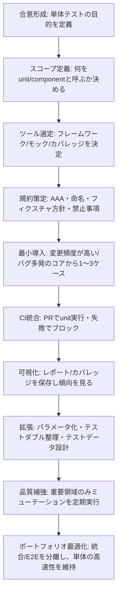

# 単体テスト（Unit Testing）リサーチ

# 単体テストの体系的研究と実践ガイド

## エグゼクティブサマリー

単体テスト（ユニットテスト）は、最小〜小さめの“単位（unit）”に対して、外部要因をできるだけ排して高速・反復可能に検証し、欠陥の早期発見とリグレッション（退行）の防止、そして安全なリファクタリングを支える技法である。テストの「単位」は組織やアーキテクチャで揺れがちだが、entity["organization","ISTQB","international software testing qualifications board"]の用語では「コンポーネントテスト（component testing）」が“個々のコンポーネントに焦点を当てたテストレベル”として定義され、同義語として unit testing などが示されているため、厳密な議論では「コンポーネントテスト」という語に寄せると誤解が減る。citeturn3search0turn20search4

単体テストの主な価値は、(1) 変更のフィードバックを最短化（速い）、(2) 外部依存を排して不安定要因を減らす（隔離・決定性）、(3) 変更に強い設計へ改善する “設計圧（design pressure）” をもたらす点にある。反面、単体テストが通っても「実環境で部品が結合して動く」ことは保証できず、統合テスト・システムテスト・受け入れテストと役割分担が必要である。citeturn20search2turn15search1turn15search5turn15search2turn20search3

本レポートは、定義と目的、メリット/限界、モック/スタブと統合テストとの関係、設計原則・ベストプラクティス、主要フレームワーク（Java/JUnit・Mockito、JS/TS/Jest・Mocha・Vitest、Python/unittest・pytest、C#/xUnit・NUnit、Go/testing、Ruby/RSpec）を横断比較し、さらにカバレッジやミューテーションテスト等のメトリクス、CI/CD統合パターン、アンチパターン、そして導入ロードマップ（Mermaid）を提示する。citeturn25search3turn14search0turn22search2turn14search2turn14search3turn21search3turn26search0turn17search3turn18search5turn30search2turn32search1turn16search1turn16search2

## 定義と目的

### 用語の整理

「単体テスト」は現場用語として広く使われる一方で、何を“単体”とみなすか（関数・クラス・モジュール・サービスなど）がプロジェクトや組織でぶれやすい。そのため、テストの粒度を誤解なく議論するには、標準的な語彙（glossary）に寄せるのが有効である。ISTQB Glossary 日本語では、**コンポーネントテスト（component testing）**を「個々のハードウェアまたはソフトウェアコンポーネントに焦点を当てたテストレベル」と定義し、同義語として「ユニットテスト（unit testing）」等を挙げている。citeturn3search0

また、Google 系のテスト工学では、**テストの“種別（unit/integration/e2e）”だけではコストや安定性が語り切れない**という前提で、サイズ（small/medium/large）やスコープ（対象範囲）といった軸で整理する流儀がある。Google の「Small test ≒ unit test、Medium ≒ integration、Large ≒ end-to-end/system」という対応づけは、単体/統合/E2E の議論を具体化する助けになる。citeturn20search0turn20search4

### 単体テストのゴール

単体テストのゴールは「品質保証をテストだけで完結させる」ことではなく、次のような“開発を加速し、事故を減らす”ための最適化にある。

- **欠陥の早期検出**：小さな単位で失敗点を局所化し、原因切り分けのコストを下げる。citeturn20search4  
- **変更の安全性（リグレッション防止）**：ふるまい上の期待を機械的に固定し、リファクタリングや最適化をしやすくする。テストピラミッドが示すように、低レベルの自動テストを厚くするのは、変更コスト（遅い/壊れやすい広範囲テスト）を抑える狙いがある。citeturn20search3turn20search7  
- **設計へのフィードバック**：外部依存を切り出し、注入可能にし、凝集度・結合度を改善する圧として機能する。単体テストを“狭いスコープ（例：単一のクラスやメソッド）”と捉える説明は、この設計フィードバックと整合する。citeturn20search4turn20search2  

なお ISTQB には「テスト目的（test objective）＝テストをする理由や目的」という用語があるため、プロジェクトで“単体テストに何を期待するか”をテスト目的として明文化しておくと、後述のメトリクス運用（カバレッジ目標など）が暴走しにくい。citeturn8search6

## 価値と限界

### 代表的なメリット

entity["company","Microsoft","technology company"]は .NET の単体テスト・ベストプラクティスとして、単体テストは **Fast / Isolated / Repeatable**（速い・隔離・反復可能）であるべき、と明確に述べている。これは言語・フレームワークを超えて、現実的な単体テスト運用の“品質基準”として使える。citeturn20search2

この基準に基づくと、単体テストのメリットは次のように整理できる。

- **開発速度の向上**：ミリ秒〜秒単位で回るテストは、編集→実行→修正のループを短くし、レビューやCIでも早く失敗に気づける。citeturn20search2turn23search13  
- **障害の局所化**：狭い単位に焦点を当てることで、失敗の原因範囲が自然に狭まり、デバッグが速くなる。citeturn20search4  
- **設計の改善**：外部依存（DB/ネットワーク/時刻など）を直接参照するコードは隔離しづらく、テストが書きにくい。テスト容易性を上げるために依存性の注入や抽象化が進み、結果として変更に強い設計になりやすい。citeturn20search2turn20search6  

### 代表的な限界と注意点

単体テストは強力だが万能ではない。限界を理解していないと、投資対効果が急落しやすい。

- **結合・実環境の保証はできない**：統合テストは“相互作用”に焦点を当てたテストレベルで、単体テストと検出対象が異なる。単体テストが通っても、インターフェース不整合、設定、トランザクション、実データ特性などは見逃し得る。citeturn15search4turn15search1turn20search3  
- **過剰なモックは脆さを生む**：実装詳細（内部呼び出し順序や private な処理）に密着したテストは、リファクタリング耐性が低くなる。モック/スタブの使い方は、スタイル（状態検証 vs ふるまい検証）によって設計への影響が変わる。citeturn4search1  
- **“カバレッジ至上主義”の罠**：カバレッジは「実行された量」の指標であり「検証の強さ」を直接は保証しない。このギャップを埋める手段としてミューテーションテストが提案されるが、計算コストが高く、適用範囲の設計が必要になる。citeturn16search11turn16search1turn16search2  

結論として、単体テストは「低コストで厚く」しやすいが、テストポートフォリオ全体（単体・統合・E2E）で最適化する必要がある、というのが最も再現性の高い理解である。citeturn20search3turn20search0turn15search5

## 関連するテスト技法とテストレベル

### テストレベルと“単体”の位置づけ

ISTQB Glossary の「テストレベル」は、プロジェクトで系統的に管理されるテスト活動のグループであり、例としてコンポーネントテスト、統合テスト、システムテスト、受け入れテストが挙げられる。citeturn2search0turn3search0turn15search5turn15search2

- **コンポーネントテスト（≒単体テスト）**：個々のコンポーネントに焦点。citeturn3search0  
- **コンポーネント統合テスト**：統合したコンポーネント間のインターフェース/相互作用の欠陥を狙う。citeturn15search1  
- **システムテスト**：システム全体が要件を満たすことに焦点。citeturn15search5  
- **受け入れテスト**：ユーザーのニーズ/要件/業務プロセスを満たすかを公式に確認し、受け入れ基準を満たすか判断する。citeturn15search2  

この整理は、テストピラミッド（低レベルのテストを多く、高レベルは少なく）という比喩と親和性が高い。citeturn20search3turn20search7

### モック・スタブ・テストダブル

単体テストで頻出するのが、依存先を置き換える **テストダブル**（stub/mock/fake 等）の活用である。用語は混同されやすく、entity["people","Martin Fowler","software engineer"]は「Mocks aren’t Stubs」で、モックとスタブが“同じものではない”こと、そして検証スタイル（状態検証とふるまい検証）に影響することを整理している。citeturn4search1

- **スタブ（stub）**：依存先の“骨組み/専用実装”として、呼び出し元が依存している機能を最小限に提供するもの（ISTQB Glossary 英語定義）。citeturn13search0  
- **モック（mock）**：テスト中に期待されるふるまいをシミュレートするテストダブルの一種（ISTQB Glossary 英語定義）。citeturn6search2  
- **フェイク（fake）**：実装として動くが、テスト用に簡略化されている代替実装。Google の “Testing on the Toilet” では、遅い/非決定的/外部機器依存などの理由で実装を使えない場合にフェイクが有用だと説明される。citeturn20search1  

実務では「何でもモック」と呼ばれがちだが、**目的が“値を返すための代替”なのか、“相互作用の検証”なのか**を区別すると、テストが実装詳細に引きずられにくい。citeturn4search1turn20search1

## 設計原則とベストプラクティス

### テストしやすいコードの原則

単体テストを機能させる設計原則は、ひと言でいえば「外部要因を境界（seam）に追い出し、コアを純化する」ことである。外部要因（ファイル・DB・ネットワーク・時刻・乱数など）はテストの隔離性・再現性を壊しやすいので、単体テストではそれらに依存しない（または置き換え可能にする）ことが推奨される。citeturn20search2turn20search6turn20search1

代表的な設計テクニックは以下。

- **依存性注入（DI）/抽象化**：外部アクセスや副作用をインターフェース越しにし、テストではスタブ/フェイク/モックを注入する。citeturn20search6turn14search0  
- **副作用の局所化**：ドメインロジックを純粋関数に寄せ、I/O は薄い層に閉じ込める（単体テストはロジックに集中しやすい）。citeturn20search2turn20search4  

### テストの書き方の規約

**AAA（Arrange-Act-Assert）**は、可読性と保守性のバランスがよい基本形である。citeturn20search10  
加えて、命名と粒度が品質を左右する。

- **命名**：`should_〜` でも `〜の場合_〜する` でもよいが、チームで統一し、失敗時に意図が読めることが最重要。命名規約の統一はベストプラクティスとして明示されている。citeturn20search10  
- **隔離**：単体テストは外部依存がない状態で単独実行でき、結果が常に一定であるべき、という指針がある。citeturn20search2  
- **フィクスチャ**：セットアップは “最小必要” にとどめ、過剰な共通化（巨大フィクスチャ）はテストの意図を曖昧にする。フレームワークごとに setUp/tearDown や beforeEach/afterEach が提供されるが、乱用はアンチパターン化しやすい。citeturn21search3turn22search4turn27search0turn18search0turn26search9  

### パラメータ化テストを“デフォルト”に寄せる

同じ性質のテストを入力だけ変えて繰り返す場合、パラメータ化は保守性を大きく改善する。

- JUnit はパラメータ化（`@ParameterizedTest` 等）を提供し、同一テストの多回実行を支援する。citeturn25search1turn21search1  
- Jest は `test.each` / `describe.each` を提供し、データ駆動テストに適する。citeturn22search1turn22search2  
- pytest は `@pytest.mark.parametrize` を提供する。citeturn17search2  

### マルチ言語サンプル：ベストプラクティスの具体例

以下は「隔離」「AAA」「パラメータ化」「明確な失敗メッセージ」を意識した例である（サンプルのドメインは単純化）。

#### Java（JUnit + Mockito）

```java
import static org.junit.jupiter.api.Assertions.assertEquals;
import static org.mockito.Mockito.*;

import org.junit.jupiter.api.Test;

class PriceServiceTest {

  @Test
  void convertsUsdToJpy_usingProvidedRate() {
    // Arrange
    ExchangeRateClient client = mock(ExchangeRateClient.class);
    when(client.usdToJpy()).thenReturn(150.0);

    PriceService sut = new PriceService(client);

    // Act
    int jpy = sut.convertUsdToJpy(10); // $10 -> ¥1500

    // Assert
    assertEquals(1500, jpy);
    verify(client).usdToJpy();   // 相互作用の検証は最小限に
    verifyNoMoreInteractions(client);
  }

  interface ExchangeRateClient {
    double usdToJpy();
  }

  static class PriceService {
    private final ExchangeRateClient client;
    PriceService(ExchangeRateClient client) { this.client = client; }
    int convertUsdToJpy(int usd) { return (int) Math.round(usd * client.usdToJpy()); }
  }
}
```

JUnit Jupiter では `@Test` と Assertions が基本要素であり、Mockito は “mock creation / verification / stubbing” を提供する、という分担で理解すると整理しやすい。citeturn25search1turn25search0turn14search0

#### JavaScript（Jest）

```javascript
// sum.js
export const sum = (a, b) => a + b;

// sum.test.js
import { sum } from './sum';

describe('sum', () => {
  test.each([
    [1, 2, 3],
    [0, 0, 0],
    [-1, 1, 0],
  ])('sum(%i, %i) = %i', (a, b, expected) => {
    expect(sum(a, b)).toBe(expected);
  });
});
```

Jest は `expect` による matcher 体系と、`test.each` によるデータ駆動を公式に案内している。citeturn22search3turn22search1turn22search2

#### Python（pytest）

```python
# price.py
def apply_discount(amount: int, rate: float) -> int:
    if not (0.0 <= rate <= 1.0):
        raise ValueError("rate must be between 0 and 1")
    return int(round(amount * (1.0 - rate)))

# test_price.py
import pytest
from price import apply_discount

@pytest.mark.parametrize(
    ("amount", "rate", "expected"),
    [
        (1000, 0.1, 900),
        (1000, 0.0, 1000),
        (1000, 1.0, 0),
    ],
)
def test_apply_discount(amount, rate, expected):
    assert apply_discount(amount, rate) == expected

def test_apply_discount_rejects_invalid_rate():
    with pytest.raises(ValueError):
        apply_discount(1000, -0.1)
```

pytest は `@pytest.mark.parametrize` を公式に解説し、また `assert` の書き換え（assertion introspection）で失敗時情報を厚くする設計を持つ。citeturn17search2turn26search2

## 主要フレームワークとツール

### 横断比較テーブル

下表は、指定された言語・フレームワーク中心に「代表機能・運用観点」を俯瞰したものである（学習コスト・エコシステムは一般的傾向の要約）。機能可否は各公式ドキュメントの記述に基づく。citeturn25search3turn14search0turn22search2turn14search2turn14search3turn21search3turn26search0turn17search3turn18search5turn30search2turn32search1

| 言語 | フレームワーク/ツール | パラメータ化 | モック/スタブ標準 | 実行コマンドの標準形 | レポート/CI親和性 | 学習コスト | エコシステム |
|---|---|---:|---:|---|---|---|---|
| Java | JUnit | ○ | △（別途） | `mvn test` / `gradle test` 等 | 高（JUnit形式の実行・連携が豊富） | 中 | 大 |
| Java | Mockito | — | ◎ | JUnit等と併用 | 高（テスト内の依存隔離） | 中 | 大 |
| JS/TS | Jest | ○（`test.each`） | ○（jest.mock等） | `npm test` 等 | 高（`--coverage` 等） | 低〜中 | 大 |
| JS/TS | Mocha | △（自作/補助） | △（別途） | `npx mocha` 等 | 高（reporter拡張） | 中 | 大 |
| JS/TS | Vitest | ○（`test.each`） | ○（`vi.*`） | `vitest` / `vitest run` | 高（coverage・CIモード） | 中 | 大 |
| Python | unittest | △（自作） | ○（unittest.mock） | `python -m unittest` | 中 | 低〜中 | 大（標準） |
| Python | pytest | ○（parametrize） | △（別途/プラグイン） | `pytest` | 高（`--junitxml` 等） | 中 | 大 |
| C# | xUnit.net | ○（Theory） | △（別途） | `dotnet test` | 高（VSTest基盤） | 中 | 大 |
| C# | NUnit | ○（TestCase） | △（別途） | `dotnet test` | 高（VSTest基盤） | 中 | 大 |
| Go | testing package | ○（テーブル駆動＋subtests） | △（別途） | `go test ./...` | 中〜高（標準出力中心） | 低〜中 | 大（標準） |
| Ruby | RSpec | △（shared examples等） | △（別途） | `rspec` / `bundle exec rspec` | 高（終了コード・出力形式） | 中 | 大 |

**未指定（unspecified）**：本要件外として、例：PHP（PHPUnit）、C/C++（GoogleTest）、Swift（XCTest）、Kotlin（Kotest）などの比較は本レポートでは未詳とする。

### フレームワーク別の要点（概要・例・強み/弱み・CI統合・公式ドキュメント）

#### Java: JUnit

**概要**：JUnit のユーザーガイドは、JUnit Jupiter でのテスト記述（`@Test`、Assertions 等）を包括的に扱う。最小例の提示があり、基本の書き方を“規格化”してくれる。citeturn25search3turn25search1turn25search0turn21search0  

**典型例（ミニ）**：

```java
import static org.junit.jupiter.api.Assertions.assertEquals;
import org.junit.jupiter.api.Test;

class CalcTest {
  @Test void add() { assertEquals(3, 1 + 2); }
}
```

**強み**：JVM世界の標準的地位。Assertions/Annotations が体系化され、タグ付け（`@Tag`）など“運用”の道具も揃う。citeturn25search0turn25search1turn25search12  
**弱み**：モック機能は別途ライブラリ依存（Mockito等）。また“テストを書ける”ことと“良いテストが書ける”ことは別問題で、規約設計が要る。citeturn14search0turn20search10  

**CI統合**：JUnit Platform の ConsoleLauncher によりCLIから起動でき、CIでの実行（失敗時に落ちる）に適する。citeturn14search1turn14search5  

**公式ドキュメント**：JUnit User Guide / Writing Tests / Assertions / Console Launcher。citeturn21search0turn25search3turn25search0turn14search1  

#### Java: Mockito

**概要**：Mockito はモック生成・検証・スタビングを提供するモッキングフレームワークで、ドキュメントは javadoc に集約されている。citeturn14search0turn14search4  

**典型例（ミニ）**：

```java
var dep = mock(Dep.class);
when(dep.fetch()).thenReturn("x");
sut.run();
verify(dep).fetch();
```

**強み**：スタビングと相互作用検証が簡潔で、テスト対象の依存を隔離しやすい。citeturn14search0turn14search12  
**弱み**：相互作用検証に寄せすぎると、実装変更に弱い“脆いテスト”になり得る（モックとスタブの混同が原因になりやすい）。citeturn4search1turn6search2  

**CI統合**：JUnit等と同時に実行されるため、CI統合は実質的に「使っているテストランナー側」に乗る。citeturn25search3turn14search0  

**公式ドキュメント**：Mockito site / javadoc。citeturn14search4turn14search0  

#### JavaScript/TypeScript: Jest

**概要**：Jest は Getting Started、Expect、Setup/Teardown、CLI 等が整備され、テスト実行・表明・前後処理・カバレッジ収集まで一気通貫で扱える。日本語ドキュメントが提供されている点も強い。citeturn22search2turn22search3turn22search4turn17search0  

**典型例（ミニ）**：

```js
test('sum', () => {
  expect(1 + 2).toBe(3);
});
```

**強み**：`expect` の matcher 体系、`beforeEach/afterEach` 等の前後処理、`test.each` によるデータ駆動、`--coverage` による収集など、標準機能が厚い。citeturn22search3turn22search4turn22search1turn17search0  
**弱み**：カバレッジ収集はテストを遅くし得る（ドキュメントでも遅延可能性に言及）。またモックステートの管理（クリア等）を怠るとテストが汚染される。citeturn17search8turn22search14  

**CI統合**：CLI（`npm test` 等）で非対話実行し、`--coverage` で成果物を生成できる。必要なら reporter を追加してJUnit XMLを吐き、CIのテストレポート機能に流せる（例：jest-junit）。citeturn17search0turn19search1turn19search13  

**公式ドキュメント**：Getting Started / Expect / Setup and Teardown / CLI。citeturn22search2turn22search3turn22search4turn17search0  

#### JavaScript/TypeScript: Mocha

**概要**：Mocha は Node.js/ブラウザ向けのテストフレームワークで、非同期テスト（done コールバック等）や柔軟なレポーティングを特徴とする。citeturn14search6turn27search1  

**典型例（ミニ）**：

```js
import assert from 'assert';

describe('calc', function () {
  it('adds', function () {
    assert.equal(1 + 2, 3);
  });
});
```

**強み**：Hooks（before/beforeEach/afterEach/after）が明確で、非同期テストの扱いがドキュメント化されている。citeturn27search0turn27search1  
**弱み**：Jest/Vitestと比べると“統合された体験”（内蔵アサーション、内蔵モック、内蔵カバレッジ等）は薄く、周辺ツール選定が必要になりやすい。citeturn14search6turn27search2  

**CI統合**：`npx mocha` で実行し、reporter を差し替えてJUnit XMLを生成できる（例：mocha-junit-reporter）。citeturn14search2turn19search2  

**公式ドキュメント**：Getting Started / Hooks / Asynchronous Code。citeturn14search2turn27search0turn27search1  

#### JavaScript/TypeScript: Vitest

**概要**：Vitest は Vite を基盤にした “次世代” テストフレームワークとして位置づけられ、Jest互換API（`test.each` など）も提供する。citeturn14search3turn24view1  

**典型例（ミニ）**：

```ts
import { expect, test } from 'vitest';

test('sqrt', () => {
  expect(Math.sqrt(4)).toBe(2);
});
```

**強み**：`test.each` / `describe.each`、`vi.fn/vi.mock/vi.spyOn`、coverage（v8/istanbul）など、実務で必要になりやすい機能を公式にガイドしている。さらに watch mode と CI向け run mode を区別して動く設計も明記されている。citeturn24view1turn23search1turn17search1turn23search13  
**弱み**：Jest互換は強いが“完全同一”ではないことがあり、移行時はAPI差分・プラグイン差分の棚卸しが必要になる（互換APIがあること自体は公式にも示唆）。citeturn24view1turn14search3  

**CI統合**：CIでは `vitest run` を明示し、coverage を有効化して成果物を保存する運用が定石。citeturn23search13turn17search1  

**公式ドキュメント**：Guide / API（test/each）/ Mocking / Coverage。citeturn14search3turn24view1turn23search1turn17search1  

#### Python: unittest

**概要**：unittest は Python 標準のユニットテストフレームワークで、`assertEqual` 等のアサーションメソッド、`setUp/tearDown`、そしてコマンドライン実行インターフェースを提供する。日本語ドキュメントが整備されている。citeturn21search3  

**典型例（ミニ）**：

```python
import unittest

class TestCalc(unittest.TestCase):
    def test_add(self):
        self.assertEqual(1 + 2, 3)

if __name__ == "__main__":
    unittest.main()
```

**強み**：標準搭載ゆえ導入障壁が低い。さらに `unittest.mock` は“テスト中の一部をモックオブジェクトで置換する”ための公式ライブラリとして提供される。citeturn21search3turn0search15  
**弱み**：pytest と比べると宣言的な fixture/parametrize 体験は薄く、拡張は書けるが“流儀”の設計が必要になりやすい。citeturn26search9turn17search2  

**CI統合**：標準ライブラリの `unittest.main()` が CLI 実行インターフェースを提供する。citeturn21search3  

**公式ドキュメント**：unittest / unittest.mock。citeturn21search3turn0search15turn26search3  

#### Python: pytest

**概要**：pytest は `assert` を中心に据えたテスト表明、fixture、パラメータ化などを提供する。特に fixture は xUnitスタイルの setup/teardown に対する改善点（明示的な名前、モジュール性、合成可能性）を公式に説明している。citeturn26search9turn26search2  

**典型例（ミニ）**：

```python
import pytest

@pytest.mark.parametrize("a,b,expected", [(1,2,3), (2,3,5)])
def test_sum(a, b, expected):
    assert a + b == expected
```

**強み**：parametrize と fixture が強力。失敗時の情報量を増やすために `assert` を書き換える仕組みも公式に説明されている。citeturn17search2turn26search9turn26search2  
**弱み**：fixture の autouse や scope を乱用すると“見えない依存”が増え、テスト理解コストが上がる（公式にも autouse の性質が説明されており、使い所が設計課題になる）。citeturn26search0turn26search4  

**CI統合**：JUnit XML を出力する `--junitxml` が公式に案内され、Jenkins等のCIサーバで利用できる。citeturn19search12turn19search0  

**公式ドキュメント**：Fixtures / Parametrize / Assert / JUnitXML。citeturn26search0turn17search2turn26search2turn19search12  

#### C#: xUnit.net

**概要**：xUnit.net は .NET 向けの単体テストフレームワークで、`[Fact]` と `[Theory]`（`[InlineData]` 等）により通常テストとパラメータ化テストを表現する。citeturn17search3  

**典型例（ミニ）**（ドキュメントに沿ったイメージ）：

```csharp
using Xunit;

public class CalcTests {
  [Theory]
  [InlineData(1, 2, 3)]
  [InlineData(2, 3, 5)]
  public void Add(int a, int b, int expected) {
    Assert.Equal(expected, a + b);
  }
}
```

**強み**：Theory/InlineData が標準的に使いやすい。加えて `dotnet test` がVSTest基盤でテスト実行し、成功/失敗を終了コードで返すことが明記されているため、CIゲートに載せやすい。citeturn17search3turn19search3  
**弱み**：モックは別途ライブラリ（Moq等）を選ぶ必要がある点で、Jestのような“一体型”とは異なる。citeturn19search3turn20search2  

**CI統合**：`dotnet test` はテスト実行の標準コマンドで、TRXロガーなどの出力例が（日本語含め）ドキュメント化されている。citeturn19search7turn19search3  

**公式ドキュメント**：xUnit Getting Started / dotnet test。citeturn17search3turn19search7  

#### C#: NUnit

**概要**：NUnit は NUnit 3+ を対象にしたドキュメントサイトを提供し、SetUp/TearDown や属性一覧などが体系化されている。citeturn18search5turn18search0turn18search9  

**典型例（ミニ）**：`[TestCase]` によるパラメータ化は公式に示される。citeturn28search0  

```csharp
using NUnit.Framework;

public class CalcTests {
  [TestCase(1, 2, 3)]
  [TestCase(2, 3, 5)]
  public void Add(int a, int b, int expected) {
    Assert.That(a + b, Is.EqualTo(expected));
  }
}
```

**強み**：属性（Attributes）の体系が厚く、SetUp/TearDown や parameterized tests も公式に整理されている。citeturn18search0turn28search1turn28search15  
**弱み**：xUnit同様、モックは別途。属性が多いがゆえにチーム規約がないと表現が散らばりやすい。citeturn18search9turn20search10  

**CI統合**：`dotnet test` でVSTest経由実行でき、TRX等の成果物生成が可能。citeturn19search3turn19search7  

**公式ドキュメント**：NUnit docs / SetUp & TearDown / TestCase。citeturn18search5turn18search0turn28search0  

#### Go: testing package

**概要**：Go は標準ライブラリ `testing` によりパッケージの自動テストを支援し、`go test` コマンドと組み合わせて `func TestXxx(*testing.T)` を自動実行する設計が明記されている。citeturn30search2turn30search14  

**典型例（ミニ）**（テーブル駆動＋subtestsの方向性）：

```go
func TestAdd(t *testing.T) {
  cases := []struct{ a, b, want int }{
    {1, 2, 3}, {2, 3, 5},
  }
  for _, tc := range cases {
    t.Run("case", func(t *testing.T) {
      if got := tc.a + tc.b; got != tc.want {
        t.Fatalf("got %d, want %d", got, tc.want)
      }
    })
  }
}
```

**強み**：標準で subtests（`T.Run`）を持ち、テーブル駆動を自然に書ける（公式ドキュメント・公式ブログで解説）。citeturn18search2turn18search18  
**弱み**：モックは標準外で、インターフェース設計・生成ツール等の選定は別途必要。citeturn20search6turn30search2  

**CI統合**：`go test` のヘルプテキストは“パッケージのテストを自動化し、結果サマリを出力する”ことを明確に述べており、`go test ./...` の形でCIに載せやすい。citeturn30search14turn30search2  

**公式ドキュメント**：Package testing / Go blog subtests / go test help（source）。citeturn30search2turn18search18turn30search14  

#### Ruby: RSpec

**概要**：RSpec は rspec コマンドのオプション体系をドキュメント化し、フォーマットやフィルタリング等を提供する。citeturn32search1turn18search7  

**典型例（ミニ）**：

```ruby
RSpec.describe "calc" do
  it "adds" do
    expect(1 + 2).to eq(3)
  end
end
```

**強み**：コマンドライン・出力形式の柔軟性が高い。さらに終了ステータス（全パスなら0、失敗があれば1）を明記しており、CIゲートに組み込みやすい。citeturn32search1turn32search2  
**弱み**：モック/スタブの流儀や過剰共有（support等）でテストが読みにくくなるリスクがあるため、規約とレビューが重要。citeturn20search10turn4search1  

**CI統合**：rspec の終了コード仕様が公式に明記され、失敗時の exit code をカスタムするオプションもある。citeturn32search2turn32search13  

**公式ドキュメント**：Command line options / Exit status。citeturn32search1turn32search2  

## メトリクス・自動化・CI/CD統合

### 推奨メトリクス

#### カバレッジ

カバレッジは「テストがどれだけコードを実行したか」を示す代表指標で、言語/ツールにより statement/line/branch などの粒度がある。coverage.py は、line に加え branch coverage も測定できると明記している。citeturn16search11turn16search3

ただし、カバレッジは“質”を直接保証しない（実行されても期待が検証されていない可能性がある）ため、**閾値を唯一の目的にせず、差分（増減）・未到達の重要分岐・欠陥流出との相関**で扱うのが実務的である、という整理が安全である。citeturn16search11turn20search2

言語別の代表ツール例（公式ドキュメントベース）：

- Java：JaCoCo（Maven/Gradle統合がドキュメント化）citeturn16search0turn16search4turn16search8  
- JS/TS：Jest（`--coverage`）/ Vitest（v8/istanbul provider）citeturn17search0turn17search1turn17search8  
- Python：coverage.py（line/branch）citeturn16search11turn16search3  
- .NET：`dotnet test --collect:"XPlat Code Coverage"`（日本語ドキュメントに例あり）citeturn19search7  
- Go：`go test -coverprofile=...` を含む公式のカバレッジ収集ガイドが提供されている。citeturn31search6  

#### ミューテーションテスト（Mutation Testing）

ミューテーションテストは「コードに小さな変更（ミュータント）を入れ、単体テストがそれを検出できるか」を測る。Stryker は“変更を加えたコードに対して単体テストを実行し、失敗しないならテストが不十分かもしれない”と明確に説明している。citeturn16search1turn16search5  
Java向けには PIT が “mutation testing system” として位置づけられている。citeturn16search2turn16search6

実務推奨としては、ミューテーションは計算コストが高いので、まず **“重要コンポーネント（決済・権限・課金・在庫など）” や “テストの薄い領域” に限定し、夜間/週次ジョブで回す**のが現実的である。概念とコストの両立という観点で、単体カバレッジの補助メトリクスとして使うのが安全である。citeturn16search1turn16search2turn20search3

### 自動化戦略とCI/CD統合パターン

単体テストをCI/CDに乗せる基本は「**実行（fail fast）→レポート（可視化）→品質ゲート（必要最小限）**」である。各ランナーのCLIは、CIでの自動化（終了コード・成果物出力）を前提に設計されている。

- `dotnet test` は成功なら終了コード0、失敗なら1を返すと明記されている。citeturn19search3turn19search7  
- pytest は `--junitxml` により Jenkins 等で読めるJUnit XMLを生成できる。citeturn19search12  
- RSpec は全パスなら0、失敗があれば1の終了ステータスを返す。citeturn32search2  
- JUnit Platform は ConsoleLauncher を提供し、コンソールからの実行を可能にする。citeturn14search1  
- Vitest は CI 環境下で run mode に切り替えることを明記している（watchではなくCI実行を意識できる）。citeturn23search13  

#### CIでよくある“分離”の型

- **Unit（高速）**：PRごとに必ず実行。  
- **Integration（中速）**：PRでは一部、mainブランチで全量、または夜間。  
- **E2E/System（低速）**：mainブランチやリリース前に重点実行。  

この分離は、テストサイズの考え方（Small/Medium/Large）とも整合し、単体テストに過剰な統合責務を負わせない設計につながる。citeturn20search0turn15search4turn20search3

### よくあるアンチパターン集

アンチパターンは「単体テストを増やしているのに、遅い・壊れる・信用できない」状態を生む。代表例は次の通り。

- **外部依存（DB/ネットワーク/時刻）を直に触る**：隔離性と反復性が崩れ、フレーク（不安定テスト）を誘発する。citeturn20search2turn20search1  
- **モックの状態を掃除しない**：テスト間でモックの呼び出し履歴や設定が汚染される。Jest/Vitestもモック状態のクリア/リストアの必要性を注意喚起している。citeturn22search14turn23search1  
- **巨大フィクスチャ/共通化しすぎ**：テストが“何を検証しているか”見えなくなる。pytestはfixtureの改善点を述べるが、autouse等の設計次第で逆効果にもなり得る。citeturn26search9turn26search0  
- **実装詳細の検証に偏る**：リファクタリングで壊れやすく、価値が下がる。モックとスタブの違いを意識しないと起きやすい。citeturn4search1turn6search2  
- **カバレッジだけを目的化**：カバレッジは量指標であり、テストの鋭さを保証しない。必要に応じてミューテーションで補助する。citeturn16search11turn16search1  

### 導入ロードマップ（Mermaid）

以下は、既存プロジェクトに単体テストを段階導入するための“失敗しにくい”流れである（単体の高速性を守り、統合・E2Eと責務分離する）。テストピラミッドとテストサイズの発想を踏まえた。citeturn20search3turn20search0turn15search4  



この流れで重要なのは、最初に「単体テストの目的」を決め、次に「スコープ（unit）」「規約」「CI」を固めることだ。単体テストは Fast/Isolated/Repeatable を満たして初めてスケールするため、初期に“速度と安定性”を破壊する設計を入れないことが決定的に重要である。citeturn20search2turn20search10turn20search0

## 対象スタック
- Backend: Kotlin / Quarkus / JUnit 5 / @InjectMock
- Frontend: TypeScript / React / Vitest / React Testing Library
